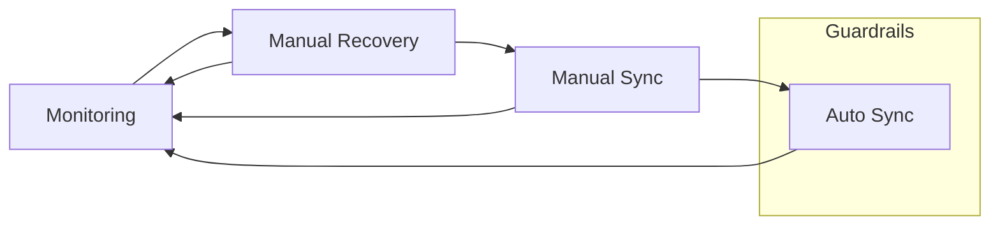

# Nagi

Nagi monitors your data, detects drift from the desired state, and automatically runs the operation you defined to fix it.

## Motivation

State evaluation, routine ELT, and data incident response are often carried out as separate activities — different tools, different runbooks, different moments. When a scheduled job succeeds but the data is stale, the gap between "the pipeline ran" and "the data is correct" surfaces as an incident that lives outside the pipeline itself.

These activities are points on the same continuum: observe state, decide it needs correction, and correct it. Nagi places them in a single reconciliation loop so you can move between monitoring, manual recovery, and automated convergence without changing tools or vocabulary.



## Install

```bash
pip install nagi-cli
```

## How It Works

Define the desired state of each asset and the sync to run when drift is detected. Then compile, evaluate, and sync.

```yaml
# conditions: "clean_data.txt exists"
apiVersion: nagi.io/v1alpha1
kind: Conditions
metadata:
  name: clean-data-check
spec:
  - name: file-exists
    type: Command
    run: [test, -f, clean_data.txt]
---
# sync: "create the file"
apiVersion: nagi.io/v1alpha1
kind: Sync
metadata:
  name: build-clean-data
spec:
  run:
    type: Command
    args: [sh, -c, "echo '...' > clean_data.txt"]
---
# asset: "when drifted, run the sync"
apiVersion: nagi.io/v1alpha1
kind: Asset
metadata:
  name: clean-data
spec:
  onDrift:
    - conditions: clean-data-check
      sync: build-clean-data
```

```console
$ nagi compile    # Validate and resolve resource definitions
$ nagi evaluate   # Evaluate conditions → reports "clean-data" as Drifted
$ nagi sync       # Run sync → creates clean_data.txt → re-evaluates as Ready
$ mv clean_data.txt dirty_data.txt
$ nagi evaluate   # Drifted again
$ nagi sync       # Restores clean_data.txt → Ready
```

`nagi serve` runs this evaluate-and-sync cycle continuously.

See the [Quickstart](https://nagi-project.dev/overview/quickstart/) for a full walkthrough, or browse the [Documentation](https://nagi-project.dev).

## License

Apache License 2.0. See [LICENSE](LICENSE) for details.
