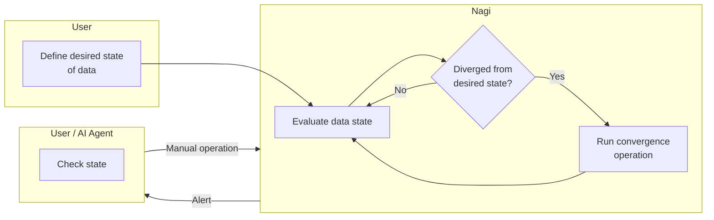

# Nagi

[](https://pypi.org/project/nagi-cli/) [](https://github.com/nagi-project/nagi/actions/workflows/ci.yml) [](https://github.com/nagi-project/nagi/blob/main/LICENSE) [](https://pypi.org/project/nagi-cli/)

Nagi keeps data in its desired state.

## Motivation

State evaluation, routine ELT, and data incident response are often carried out as separate activities — different tools, different runbooks, different moments. When a scheduled job succeeds but the data is stale, the gap between "the pipeline ran" and "the data is correct" surfaces as an incident that lives outside the pipeline itself.

These activities are points on the same continuum: observe state, decide it needs correction, and correct it. Nagi places them in a single reconciliation loop so you can move between monitoring, manual recovery, and automated convergence without changing tools or vocabulary.



## Principles

- Declarative — Define the desired state; let Nagi handle convergence.
- Composable — Use with your existing tools, or let Nagi take the wheel.
- AI-collaborative — Designed for humans and AI agents to work as one.

## Install

```bash
pip install nagi-cli
```

See the [Quickstart](https://nagi-project.dev/overview/quickstart/) for a full walkthrough, or browse the [Documentation](https://nagi-project.dev).

## License

Apache License 2.0. See [LICENSE](LICENSE) for details.
