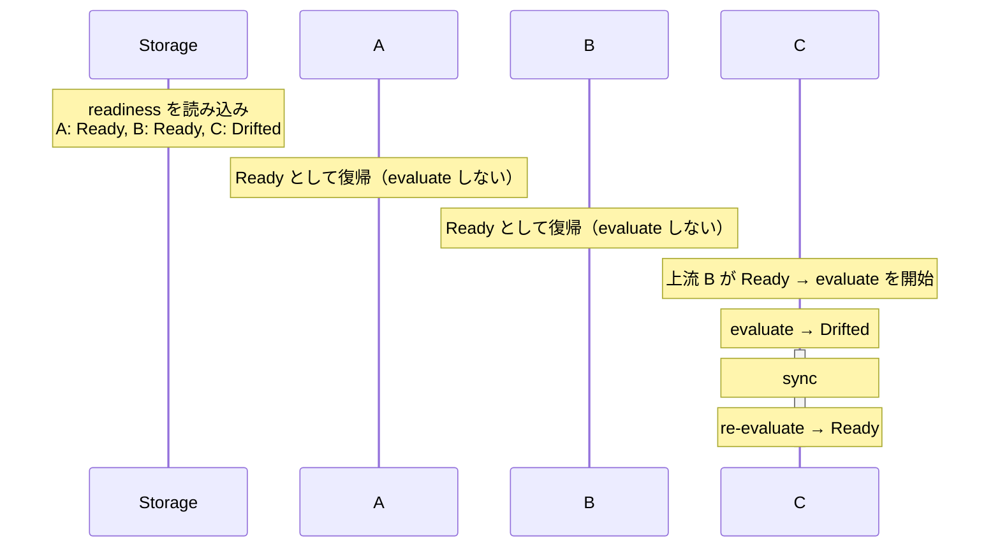
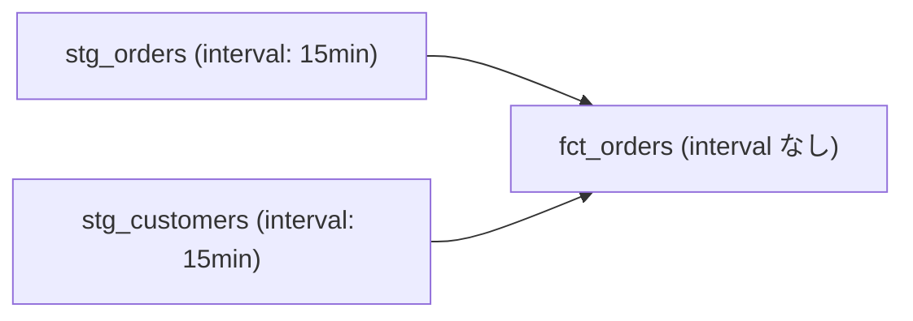
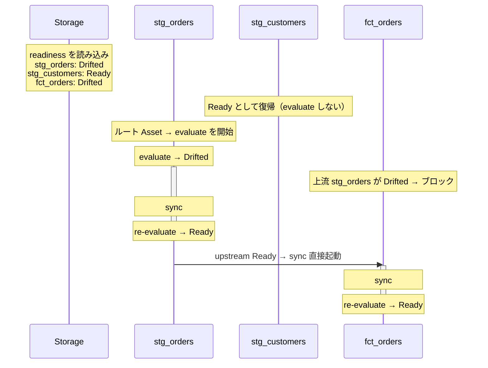

# Serve Restart

`nagi serve` は、プロセスを再起動しても前回の状態を引き継いでループを再開できます。

Nagi は各 Asset の最新の評価結果（Ready または Drifted）をストレージに保存しています。再起動時にこの情報を読み込むことで、前回 Ready となっていた Asset はそのまま Ready として復帰し、Drifted であった Asset だけが evaluate から再開します。

!!! tip
    この仕組みは、再起動後も同じストレージを参照できることを前提にしています。ローカルストレージの場合はディスクが永続化されていること、リモートストレージの場合は [`nagi.yaml`](../configurations/project.md) でバックエンドが設定されていることを確認してください。ストレージの詳細については [Storage](./storage.md) を参照してください。

## Restart Sequence

1. ストレージから readiness と suspended を読み込む
2. 前回 Ready だった Asset は Ready のまま復帰する。evaluate は実行しない
3. 前回 Drifted だった Asset、または readiness が存在しない Asset は、上流を持たないもの（ルート）のみ evaluate を開始する
4. `interval` 付きの Asset はタイマーを再登録する。評価時刻は `interval` から再計算される

readiness ファイルが存在しない場合（初回起動）は、すべての Asset を Drifted として扱います。ルート Asset の evaluate は [Concurrency Limits](../configurations/project.md) の範囲内で実行されます。

## Linear Chain with Partial Recovery

A → B → C の依存チェーンで、前回 B まで Ready だった状態から再起動した場合の例です。

A と B は前回 Ready だったため、再起動後もそのまま Ready です。C は Drifted だったため evaluate から開始しますが、上流の B が Ready として復元されているのでブロックされません。

## Fan-in with Interrupted Sync

staging → fact テーブルの構成で、sync 中にプロセスが停止した場合の例です。stg_orders と stg_customers は interval 付きのルート Asset、fct_orders はその下流です。前回 stg_orders の sync 中にプロセスが停止し、stg_customers は Ready だった場合を示します。

stg_customers は前回 Ready だったため何もせず復帰します。
stg_orders は Drifted なので evaluate から再開し、Ready になった時点で fct_orders への sync が起動します。
fct_orders は stg_orders が Drifted の間はブロックされ、stg_customers が Ready でも動きません。すべての上流が Ready になることが sync の起動条件であるためです。
