# Serve Scenarios

`nagi serve` の動作を具体的なケースで説明します。各ケースでは、evaluate と sync がどのタイミングで実行されるかを時系列で示します。

なお、すべてのケースで `autoSync: true` を前提としています。

## Case 1: Linear Dependency Chain

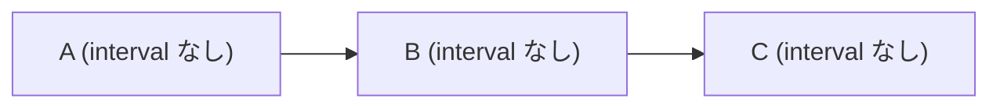

sync は各 Asset で1回ずつ、上流から順に収束します。

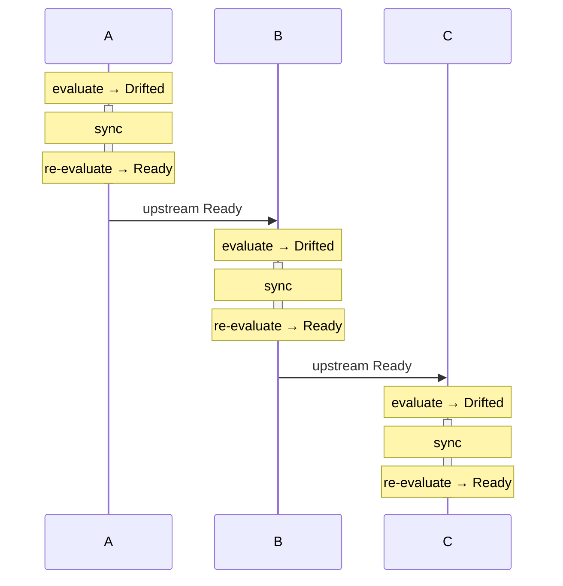

## Case 2: Multiple Upstreams Become Ready in Quick Succession

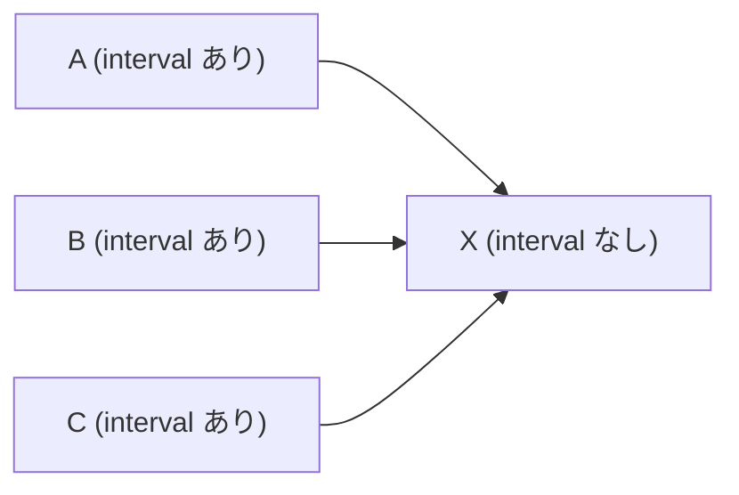

A, B, C が近いタイミングで Ready に遷移した例です。**X の sync は1回だけです。**

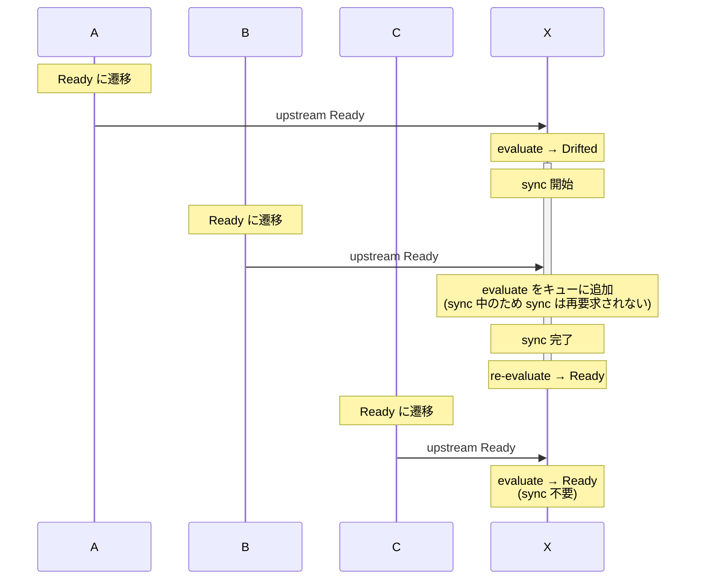

## Case 3: Upstreams Become Ready with Large Intervals

Case 2 と同じグラフで、上流の Ready 遷移が間隔を空けて起きるケースです。一度 Ready になった X は、X 自身の状態が変わらない限り Ready のままです。**X の sync は1回だけです。**

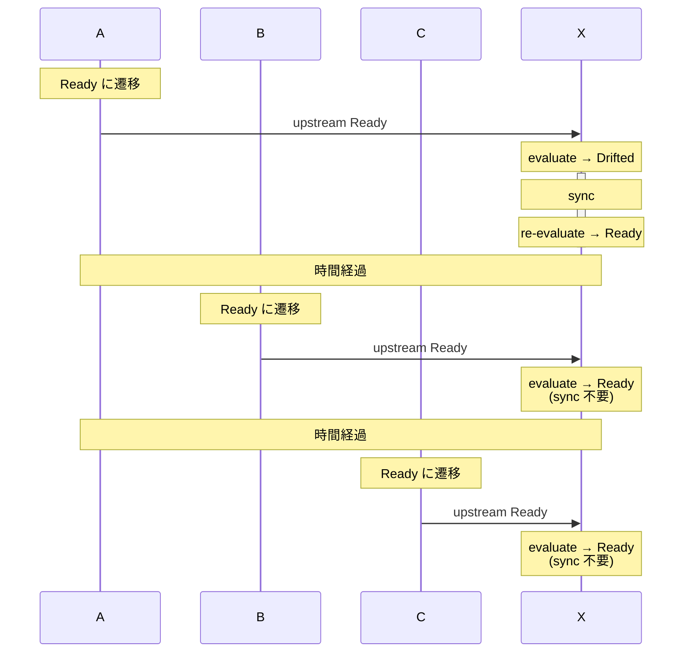

## Case 4: Fan-out

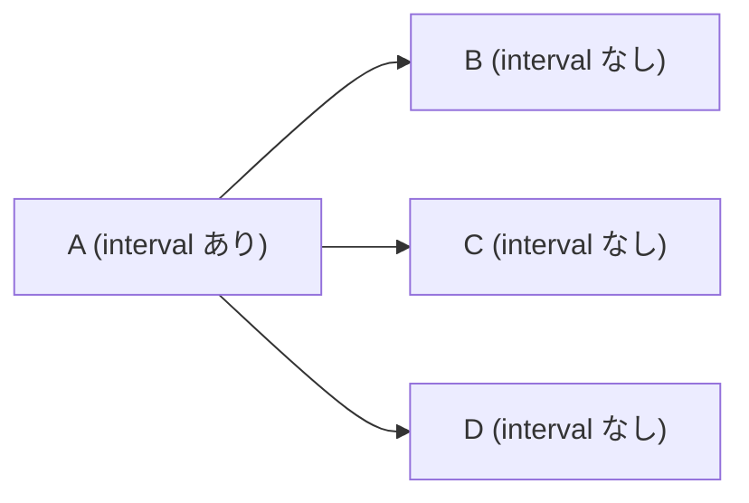

A が Ready に遷移すると、B, C, D の evaluate が同時に起動されます。B, C, D は互いに依存関係がないため、sync は並列に実行されます。

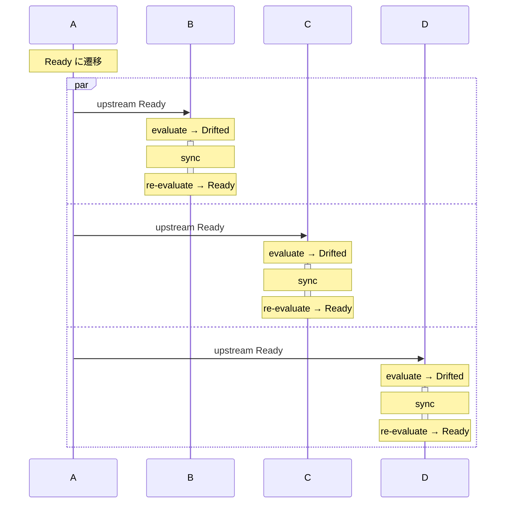

## Case 5: Diamond Dependency

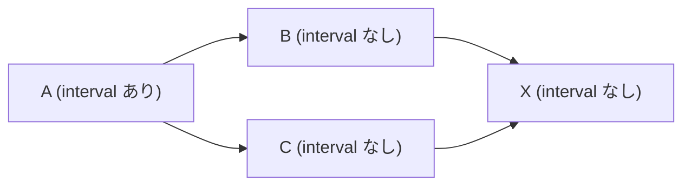

Fan-out と Fan-in の組み合わせです。A の Ready が B と C に伝播し、B と C の Ready がそれぞれ X に伝播します。B と C の sync 完了タイミングが異なるため、X の evaluate は2回起動されますが、**X の sync は1回だけです。**

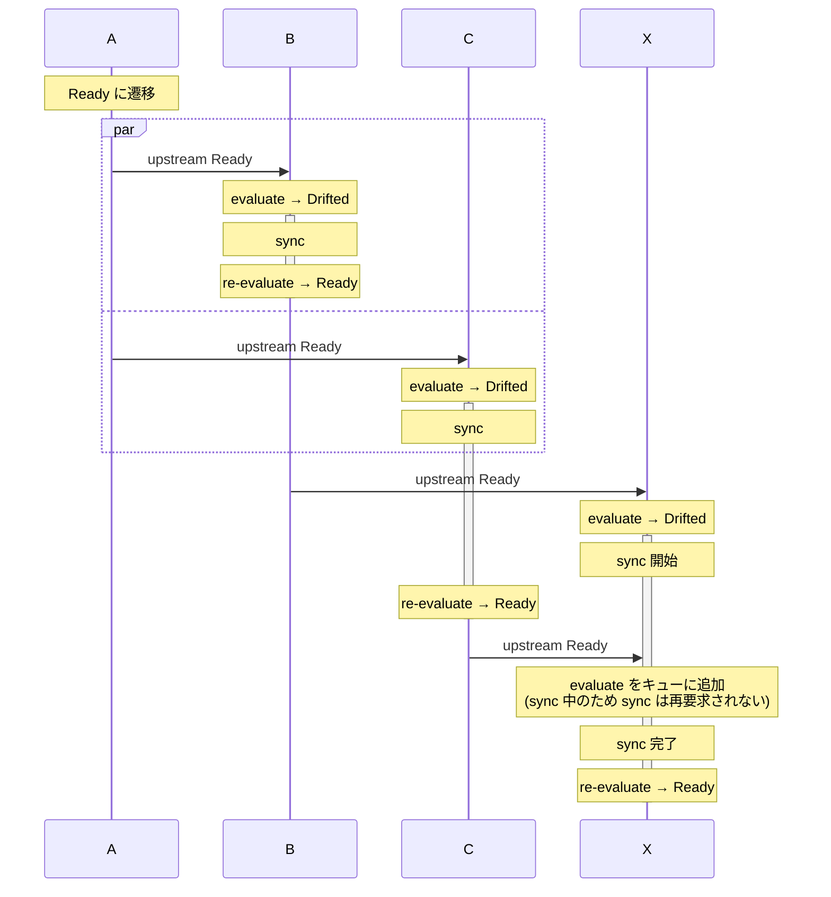

B と C の sync 完了が近いタイミングであっても、X の sync が実行中であれば重複実行は発生しません。

## Case 6: Interval with Upstream Propagation

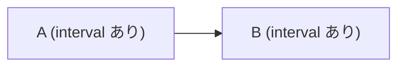

B はポーリングと上流の状態変化の両方で evaluate が起動されます。

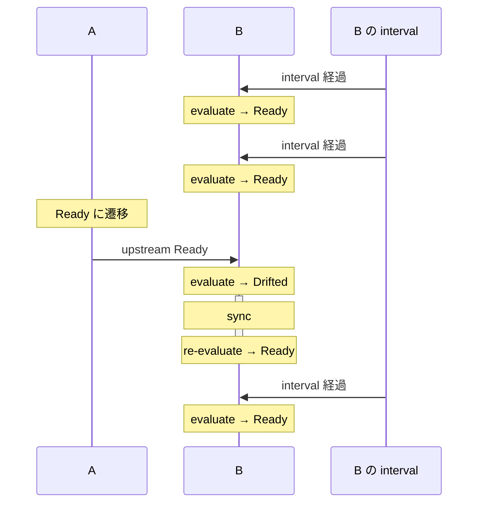

interval による evaluate は上流の状態変化とは独立して動作します。どちらが先に Drifted を検出しても、sync は同じように実行されます。
