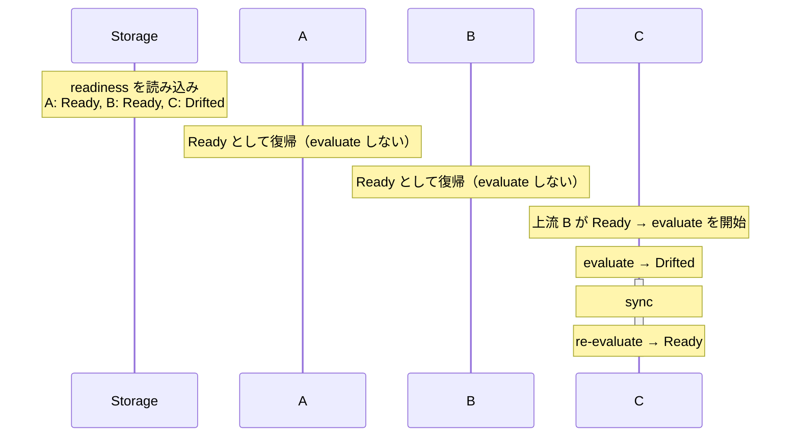
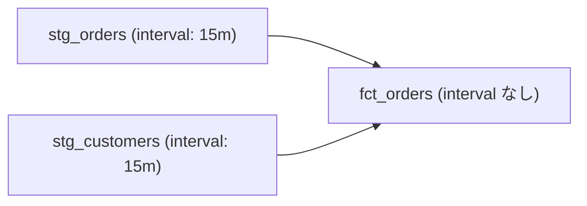
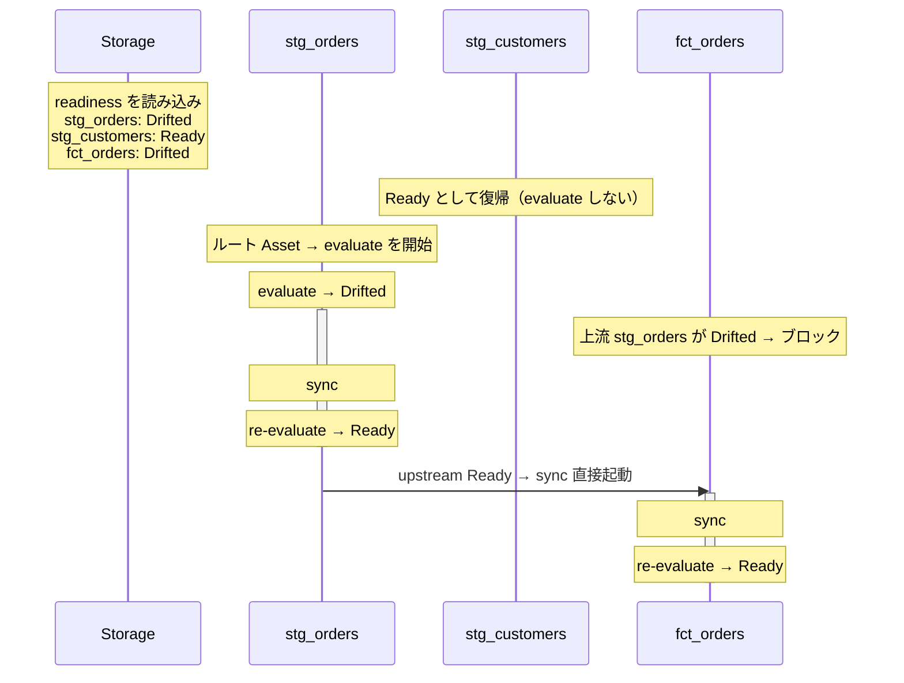

# Serve

[`nagi serve`](../cli.md#serve) で行っている評価と収束の内部動作を説明します。

## Overview

`nagi serve` は単一プロセス・マルチタスクの継続的な reconciliation ランタイムです。依存グラフの連結成分（互いに依存関係でつながった Asset の集まり）ごとに独立した async Controller が並列に動作します。起動の前に [`nagi compile`](../cli.md#compile) を実行し、コンパイル済みの Asset と依存グラフを読み込んで、評価と収束のループを開始します。


## Controller

Controller は、単一の連結成分を担当する async イベントループです。

### Graph Partitioning

依存グラフの連結成分を自動検出し、互いに依存関係のない Asset 群を独立したグループに分割します。そのグループごとに Controller が起動し、並列に動作します。

```text
serve
├── Controller A (raw-sales → daily-sales → monthly-report)
├── Controller B (raw-logs → access-stats)
└── shutdown watch
```

`nagi serve` を実行すると、グラフの構造に合わせて controller が複数起動します。分割を意識する必要はありません。

### Controlled Events

Controller は 4 種類のイベントを待ち受け、そのイベントに対応する処理を実行します。

| イベント | 処理 |
| --- | --- |
| ポーリング / 定時起動 | 指定した evaluate をキューに追加 |
| Evaluate タスクの完了 | 評価結果を記録し、Drifted なら sync をキューに追加。Ready に遷移した場合は下流 Asset の sync を直接起動 |
| Sync タスクの完了 | 結果を記録し、evaluate をキューに追加。失敗なら Guardrails を更新 |
| Shutdown シグナル（Ctrl-C） | 新規タスクの発行を停止し、実行中の sync の完了を待つ |

Evaluate と sync はそれぞれ非同期タスクとして発行されますので、Controller のループをブロックしません。

### Concurrency Limits

Controller 内の evaluate と sync の同時実行数には、それぞれ上限を設けることができます。起動直後にルート Asset が大量にキューに入る場合や、上流 Asset の Ready 遷移で多数の下流 sync が同時起動される場合に、データウェアハウスへのクエリ負荷を制御するために使います。

[`nagi.yaml`](../configurations/project.md) の `maxEvaluateConcurrency` と `maxSyncConcurrency` で設定します。省略時は無制限です。

## Evaluate Triggers

Evaluate は、以下のいずれかの条件で起動されます。

### Interval

`interval` を設定すると、その間隔で定期的に evaluate を実行します。

Freshness では `interval` が必須です。SQL / Command では省略できます。

!!! tip "interval を設定するケース"
    - Nagi の外側でデータが更新される可能性がある場合（外部ジョブ、手動更新など）
    - 状態を定期的に監視したい場合

!!! tip "interval を省略するケース（SQL / Command のみ）"
    - 上流 Asset の状態変化による sync と、その後の re-evaluate だけで十分な場合
        - `interval` を省略した条件は、sync 後の re-evaluate のみで評価されます

### Scheduled Evaluation

Freshness 条件では、`interval` による定期評価に加えて、`checkAt` で特定の時刻にも evaluate を実行できます。例えば、データの受け渡し時刻が決まっている場合に使えます。

### Upstream State Change

Asset の状態が Drifted から Ready に遷移すると、その Asset に依存する下流 Asset の sync を evaluate をスキップして直接起動します。sync 完了後に re-evaluate を実行し、収束結果を確認します。

上流 Asset が Drifted から Ready に遷移したことは、上流のデータに変化があったことを意味します。これは下流 Asset のデータが古くなったことを意味しますので、evaluate での状態確認をスキップして sync を起動します。

上流 Asset が Drifted の間は、下流 Asset の evaluate と sync はすべてブロックされます。仮に下流 Asset が interval を持っていても、上流 Asset が Ready になるまで evaluate は実行されません。すべての上流 Asset が Ready になることが、下流 Asset の sync が始まる前提条件です。

具体的な動作パターンは [Serve Scenarios](./serve-scenarios.md) を参照してください。

## Sync Execution

Sync は以下のいずれかで起動されます。

1. `autoSync: true` のとき、Evaluate で Drifted と判定された場合
2. 上流 Asset が Drifted → Ready に遷移した場合（evaluate をスキップして直接起動）

そして Sync は下記の制約のもとで行われます。

| 制約 | 説明 |
| --- | --- |
| 排他ロック | 同じ Asset に対する sync は同時に1つしか実行しない。ロックの詳細は [Storage: Locks](./storage.md#locks) を参照 |
| Guardrails | Sync 後の状態悪化や連続失敗を検知すると、その Asset の sync を自動停止する。詳細は [Concepts: Guardrails](../concepts.md#guardrails) を参照 |
| Auto sync | Asset ごとに設定可能（[kind: Asset](../configurations/resources/asset.md) の `autoSync`、デフォルト `true`）。<br>`true` の場合は自動的に sync を実行する。<br>`false` の場合は evaluate のみ実行し、sync は実行しない。Evaluate で失敗した際に通知される情報をもとに、 CLI から sync を手動実行する |

Sync 完了後は自動で evaluate を実行し、収束結果を確認します。

## Minimal State Design

`nagi serve` は、次にどの Asset を evaluate するか、sync を実行するかといった制御をインメモリの状態に基づいて行います。これは、ループの実行中にストレージを参照して次のアクションを決定しないことを意味します。

一部の状態はストレージバックエンド（ローカルファイルまたはリモートストレージ）に書き出され、プロセスの再起動後も保持されます。対象は下記の2つです。

- **Readiness**：Asset ごとの直近の評価結果。evaluate のキャッシュとしても機能し、TTL 内であればクエリの実行をスキップします。再起動時には、この情報をもとにループを復元します
- **Suspended**：Guardrails による停止状態。[suspended ファイル](./storage.md#suspended) から復元します

スケジューラの状態、キュー、実行中タスクの情報は永続化しません。再起動後の評価時刻は `interval` から再計算されます。永続化されるデータの全体像は [Storage](./storage.md) を参照してください。

## Graceful Shutdown

`Ctrl-C` を受信すると graceful shutdown を開始します。

1. 新規の evaluate / sync タスクの発行を停止
2. 実行中の evaluate タスクを中断（読み取り専用なので副作用はありません）
3. 実行中の sync サブプロセスの完了を待つ

待機時間の上限は [`nagi.yaml`](../configurations/project.md) の `terminationGracePeriodSeconds` で設定できます（省略時は無期限）。

## Restart

`nagi serve` は、プロセスを再起動しても前回の状態を引き継いでループを再開できます。

Nagi は各 Asset の最新の評価結果（Ready または Drifted）をストレージに保存しています。再起動時にこの情報を読み込むことで、前回 Ready となっていた Asset はそのまま Ready として復帰し、Drifted であった Asset だけが evaluate から再開します。

!!! tip
    この仕組みは、再起動後も同じストレージを参照できることを前提にしています。ローカルストレージの場合はディスクが永続化されていること、リモートストレージの場合は [`nagi.yaml`](../configurations/project.md) でバックエンドが設定されていることを確認してください。ストレージの詳細については [Storage](./storage.md) を参照してください。

### Restart Sequence

1. ストレージから readiness と suspended を読み込む
2. 前回 Ready だった Asset は Ready のまま復帰する。evaluate は実行しない
3. 前回 Drifted だった Asset、または readiness が存在しない Asset は、上流を持たないもの（ルート）のみ evaluate を開始する
4. `interval` 付きの Asset はタイマーを再登録する。評価時刻は `interval` から再計算される

readiness ファイルが存在しない場合（初回起動）は、すべての Asset を Drifted として扱います。ルート Asset の evaluate は [Concurrency Limits](../configurations/project.md) の範囲内で実行されます。

### Linear Chain with Partial Recovery

A → B → C の依存チェーンで、前回 B まで Ready だった状態から再起動した場合の例です。



A と B は前回 Ready だったため、再起動後もそのまま Ready です。C は Drifted だったため evaluate から開始しますが、上流の B が Ready として復元されているのでブロックされません。

### Fan-in with Interrupted Sync

staging → fact テーブルの構成で、sync 中にプロセスが停止した場合の例です。stg_orders と stg_customers は interval 付きのルート Asset、fct_orders はその下流です。前回 stg_orders の sync 中にプロセスが停止し、stg_customers は Ready だった場合を示します。





stg_customers は前回 Ready だったため何もせず復帰します。stg_orders は Drifted なので evaluate から再開し、Ready になった時点で fct_orders への sync が起動します。fct_orders は stg_orders が Drifted の間ブロックされ、stg_customers が Ready でも動きません。すべての上流が Ready であることが前提条件です。
