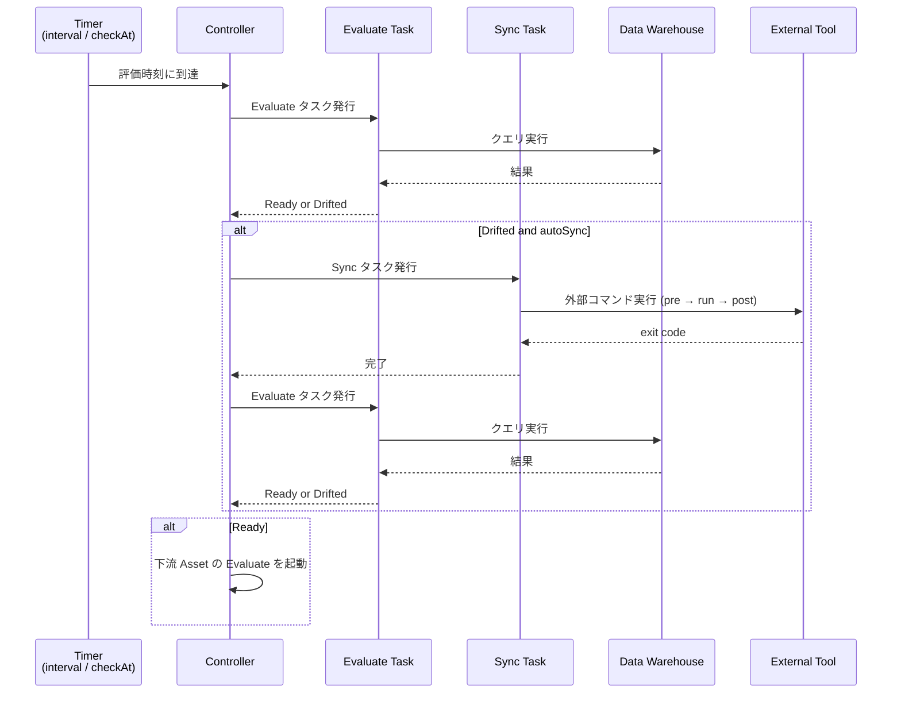

# Serve

[`nagi serve`](../cli.md#serve) で行っている評価と収束の内部動作を説明します。

## Overview

`nagi serve` は単一プロセス・マルチタスクの継続的な reconciliation ランタイムです。依存グラフの連結成分（互いに依存関係でつながった Asset の集まり）ごとに独立した async Controller が並列に動作します。起動の前に [`nagi compile`](../cli.md#compile) を実行し、コンパイル済みの Asset と依存グラフを読み込んで、評価と収束のループを開始します。



## Controller

Controller は、単一の連結成分を担当する async イベントループです。

### Graph Partitioning

依存グラフの連結成分を自動検出し、互いに依存関係のない Asset 群を独立したグループに分割します。そのグループごとに Controller が起動し、並列に動作します。

```text
serve
├── Controller A (raw-sales → daily-sales → monthly-report)
├── Controller B (raw-logs → access-stats)
└── shutdown watch
```

`nagi serve` を実行すると、グラフの構造に合わせて controller が複数起動します。分割を意識する必要はありません。

### Controlled Events

Controller は 4 種類のイベントを待ち受け、そのイベントに対応する処理を実行します。

| イベント | 処理 |
| --- | --- |
| ポーリング / 定時起動 | 指定した evaluate をキューに追加 |
| Evaluate タスクの完了 | 評価結果を記録し、Drifted なら sync をキューに追加。Ready に遷移した場合は下流 Asset の evaluate を起動 |
| Sync タスクの完了 | 結果を記録し、evaluate をキューに追加。失敗なら Guardrails を更新 |
| Shutdown シグナル（Ctrl-C） | 新規タスクの発行を停止し、実行中の sync の完了を待つ |

Evaluate と sync はそれぞれ非同期タスクとして発行されますので、Controller のループをブロックしません。

## Evaluate Triggers

Evaluate は、以下のいずれかの条件で起動されます。

### Interval

`interval` を設定すると、その間隔で定期的に evaluate を実行します。

Freshness では `interval` が必須です。SQL / Command では省略できます。

!!! tip "interval を設定するケース"
    - Nagi の外側でデータが更新される可能性がある場合（外部ジョブ、手動更新など）
    - 状態を定期的に監視したい場合

!!! tip "interval を省略するケース（SQL / Command のみ）"
    - 上流 Asset の sync 完了後に状態を評価すれば十分である場合
        - `interval` を省略した条件は、上流 Asset の状態変化と sync 後の evaluate のみで評価されます

### Scheduled Evaluation

Freshness 条件では、`interval` による定期評価に加えて、`checkAt` で特定の時刻にも evaluate を実行できます。例えば、データの受け渡し時刻が決まっている場合に使えます。

### Upstream State Change

Asset の状態が Drifted から Ready に遷移すると、その Asset に依存する下流 Asset の evaluate を即座に実行します。これは、`interval` の設定に関係なく実行されます。

複数の上流を持つ Asset で evaluate や sync がどのように実行されるかは [Serve Scenarios](./serve-scenarios.md) を参照してください。

## Sync Execution

Drifted と判定された Asset は、デフォルト設定では sync が自動的に開始されます。

Sync は下記の制約のもとで行われます。

| 制約 | 説明 |
| --- | --- |
| 排他ロック | 同じ Asset に対する sync の同時実行を防止。ロックの詳細は [Storage: Locks](./storage.md#locks) を参照 |
| Guardrails | Sync 後の状態悪化や連続失敗で sync を停止。詳細は [Concepts: Guardrails](../concepts.md#guardrails) を参照 |
| Auto sync | Asset ごとに設定可能（[kind: Asset](../configurations/resources/asset.md) の `autoSync`、デフォルト `true`）。<br>`true` の場合は自動的に sync を実行する。<br>`false` の場合は evaluate のみ実行し、sync は実行しない。Evaluate で失敗した際に通知される情報をもとに、 CLI から sync を手動実行する |

Sync 完了後は自動で evaluate を実行し、収束結果を確認します。

## Stateless Design

`nagi serve` は、次にどの Asset を evaluate するか、sync を実行するかといった制御をすべてインメモリ状態に基づいて行います。外部のデータベースやメッセージキューに依存しません。

この設計の利点は2つあります。

1. Evaluate は現在のデータの状態を直接評価するため、中断地点を記録・復元する必要がありません。プロセスが再起動しても、評価対象は現在のデータの状態に変わりはありません。
2. 実行制御が状態ストアに依存しないため、コンテナなどのステートレスな実行環境にデプロイできます

実行ログ（[logs.db](./storage.md#logs)）やキャッシュ（[cache](./storage.md#caches)）はファイルに永続化されますが、これらは記録と参照のためです。Serve のループ制御には使用しません。

!!! tip
    再起動をしたあと、評価時刻は Asset の `interval` から再計算されます。Guardrails による停止状態のみ [suspended ファイル](./storage.md#suspended) から復元されます。

## Graceful Shutdown

`Ctrl-C` を受信すると graceful shutdown を開始します。

1. 新規の evaluate / sync タスクの発行を停止
2. 実行中の evaluate タスクを中断（読み取り専用なので副作用はありません）
3. 実行中の sync サブプロセスの完了を待つ

待機時間の上限は [`nagi.yaml`](../configurations/project.md) の `terminationGracePeriodSeconds` で設定できます（省略時は無期限）。
