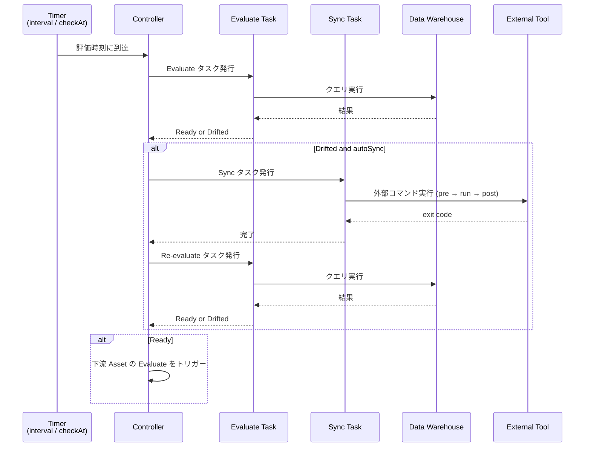

# Serve

[`nagi serve`](../cli.md#serve) の内部動作を説明します。

## Overview

`nagi serve` は単一プロセスで動作する継続的な reconciliation ランタイムです。起動時に [`nagi compile`](../cli.md#compile) を実行し、コンパイル済みの Asset と依存グラフを読み込んで、evaluate と sync のループを開始します。



## Controller

Controller は、ひとつの連結成分を担当する async イベントループです。

### Graph Partitioning

依存グラフの連結成分を自動検出し、互いに依存関係のない Asset 群を独立したグループに分割します。グループごとに Controller が起動し、並列に動作します。

```text
serve
├── Controller A (raw-sales → daily-sales → monthly-report)
├── Controller B (raw-logs → access-stats)
└── shutdown watch
```

ユーザーは `nagi serve` を実行するだけでよく、グラフの分割を意識する必要はありません。

### Controlled Events

以下の4種類のイベントを待ち受け、対応する処理を実行します。

| イベント | 処理 |
| --- | --- |
| interval / checkAt のタイマー発火 | 対象条件の evaluate をキューに追加 |
| evaluate タスクの完了 | 結果を記録し、Drifted なら sync をキューに追加。Ready に遷移した場合は下流 Asset の evaluate をトリガー |
| sync タスクの完了 | 結果を記録し、re-evaluate をキューに追加。失敗なら Guardrails を更新 |
| shutdown シグナル（Ctrl-C） | 新規タスクの発行を停止し、実行中の sync の完了を待つ |

evaluate と sync はそれぞれ非同期タスクとして発行され、Controller ループをブロックしません。

## Evaluate Triggers

Evaluate は、以下のいずれかの条件でトリガーされます。トリガーは Asset の各条件ごとに設定します。

### Interval

`interval` を設定すると、その間隔で定期的に evaluate を実行します。

Freshness では `interval` が必須です。SQL / Command では省略できます。

> **💡 interval を設定するケース**
>
> - Nagi の外側でデータが更新される可能性がある場合（外部ジョブ、手動更新など）
> - データソースの状態を定期的に監視したい場合

<!-- -->

> **💡 interval を省略するケース（SQL / Command のみ）**
>
> - 上流 Asset の sync 完了後にだけ評価すれば十分な場合
> - `interval` を省略した条件は、上流 Asset の状態変化と sync 後の re-evaluate のみで評価されます

### Scheduled Evaluation

Freshness 条件では、`interval` による定期評価に加えて、`checkAt` で特定の時刻にも evaluate を実行できます。例えば、毎朝3時にデータの鮮度を確認するといった用途に使います。

### Upstream State Change

Asset が Drifted から Ready に遷移すると、その Asset に依存する下流 Asset の evaluate を即座に実行します。`interval` の設定に関係なく発火します。

## Sync Execution

Evaluate で Drifted と判定された Asset に対し、`autoSync: true` であれば sync が自動実行されます。

Sync は下記の制約のもとで行われます。

| 制約 | 説明 |
| --- | --- |
| 排他ロック | 同じ [kind: Sync](../configurations/resources/sync.md) を参照する Asset 同士は直列実行。ロックの詳細は [Storage: Locks](./storage.md#locks) を参照 |
| Guardrails | sync 後の状態悪化や連続失敗で sync を停止。詳細は [Concepts: Guardrails](../concepts.md#guardrails) を参照 |
| autoSync | `true` の場合は自動的に sync を実行する。<br>`false` の場合は evaluate のみ実行し sync は実行しない。Evaluate で失敗した際に通知される情報をもとに、ユーザーが CLI から手動で実行する |

sync 完了後は自動で re-evaluate を実行し、収束結果を確認します。

## Stateless Design

`nagi serve` は、次にどの Asset を evaluate するか、sync を実行するかといった制御をすべてインメモリ状態に基づいて行います。外部のデータベースやメッセージキューに依存しません。

この設計には2つの理由があります。

1. evaluate はデータウェアハウスに直接クエリを投げるため、データの正しさの源泉は常にデータソース自体です。状態を別途保存して同期を取る必要がありません
2. 状態を持たない設計にすることで、ステートレスな実行環境（コンテナ、サーバーレス等）にデプロイできます。プロセスが終了しても、再起動すればデータソースの現在の状態から評価を再開します

実行ログ（[logs.db](./storage.md#logs)）やキャッシュ（[cache](./storage.md#caches)）はファイルに永続化されますが、これらは記録と参照のためです。serve のループ制御には使用しません。

再起動をしたあと、評価時刻は asset の `interval` から再計算されます。Guardrails による停止状態のみ [suspended ファイル](./storage.md#suspended) から復元されます。

## Graceful Shutdown

`Ctrl-C` を受信すると graceful shutdown を開始します。

1. 新規の evaluate / sync タスクの発行を停止
2. 実行中の evaluate タスクを中断（読み取り専用なので安全）
3. 実行中の sync サブプロセスの完了を待つ

待機時間の上限は [`nagi.yaml`](../configurations/project.md) の `terminationGracePeriodSeconds` で設定できます（省略時は無期限）。
