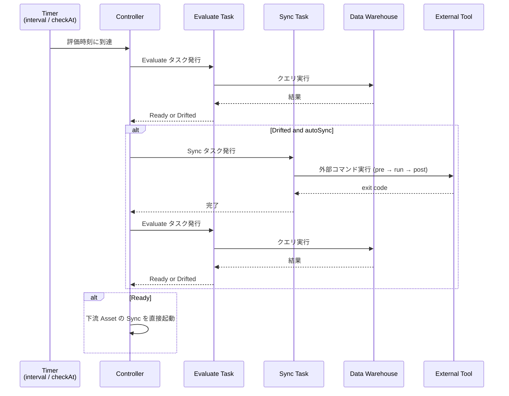
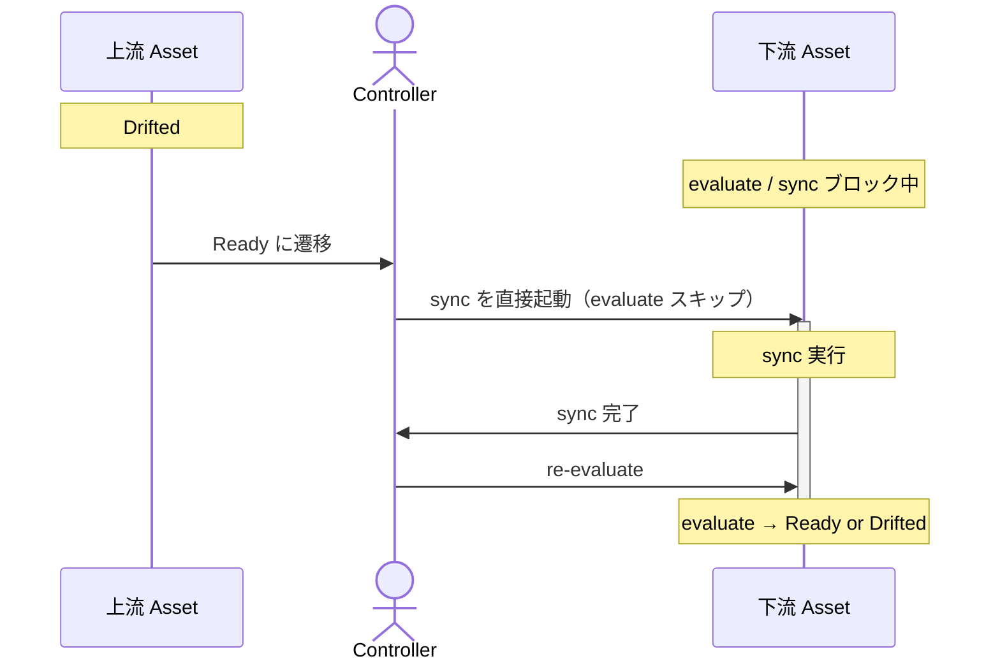

# Serve Internals

[`nagi serve`](../../reference/cli.md#serve) で行っている評価と収束の内部動作を説明します。

## Overview

`nagi serve` は単一プロセス・マルチタスクの継続的な reconciliation ランタイムです。依存グラフの連結成分（互いに依存関係でつながった Asset の集まり）ごとに独立した async Controller が並列に動作します。起動の前に [`nagi compile`](../../reference/cli.md#compile) を実行し、コンパイル済みの Asset と依存グラフを読み込んで、評価と収束のループを開始します。



## Controller

Controller は、単一の連結成分を担当する async イベントループです。

### Graph Partitioning

依存グラフの連結成分を自動検出し、依存関係のある Asset をグループとみなして分割します。そのグループごとに Controller が起動し、並列に動作します。

```text
serve
├── Controller A (raw-sales → daily-sales → monthly-report)
├── Controller B (raw-logs → access-stats)
└── shutdown watch
```

`nagi serve` を実行すると、グラフの構造に合わせて controller が複数起動します。分割を意識する必要はありません。

### Controlled Events

Controller は 4 種類のイベントを待ち受け、そのイベントに対応する処理を実行します。

| イベント | 処理 |
| --- | --- |
| ポーリング / 定時起動 | 指定した evaluate をキューに追加 |
| Evaluate タスクの完了 | 評価結果を記録し、Drifted なら sync をキューに追加。Ready に遷移した場合は下流 Asset の sync を直接起動 |
| Sync タスクの完了 | 結果を記録し、evaluate をキューに追加。失敗なら Guardrails を更新 |
| Shutdown シグナル（Ctrl-C） | 新規タスクの発行を停止し、実行中の sync の完了を待つ |

Evaluate と sync はそれぞれ非同期タスクとして発行されますので、Controller のループをブロックしません。

### Concurrency Limits

Controller 内の evaluate と sync の同時実行数には、それぞれ上限を設けることができます。起動直後にルート Asset が大量にキューに入る場合や、上流 Asset の Ready 遷移で多数の下流 sync が同時起動される場合に、データウェアハウスへのクエリ負荷を制御するために使います。

[`nagi.yaml`](../../reference/project.md) の `maxEvaluateConcurrency` と `maxSyncConcurrency` で設定します。省略時は無制限です。

## Evaluate Triggers

Evaluate は、以下のいずれかの条件で起動されます。

### Interval

`interval` を設定すると、その間隔で定期的に evaluate を実行します。

Type ごとの設定要否に対する目安を示します。

| Condition type | interval | 設定にあたっての判断基準 |
| --- | --- | --- |
| Freshness | 設定する | 必須設定のため |
| SQL / Command | 設定する | Nagi の外側でデータが更新される可能性がある、または状態を定期的に確認したい場合 |
| SQL / Command | 省略する | 上流 Asset の状態変化による sync と re-evaluate で十分な場合。sync 後の re-evaluate でのみ評価される |

### Scheduled Evaluation

Freshness では、`interval` による定期評価に加えて、`checkAt` での定時評価も実行できます。例えば、データの受け渡し時刻が決まっている場合に使えます。

### Upstream State Change

Asset の状態が Drifted から Ready に遷移すると、その Asset に依存する下流 Asset の sync を実行します。この場合 evaluate をスキップして直接 Sync を起動します。これは、上流 Asset が Drifted から Ready に遷移しているため、下流 Asset のデータが古くなったと解釈するためです。

Sync が終わったあとは evaluate を実行し、収束結果を確認します。



上流 Asset が Drifted の間は、下流 Asset の evaluate と sync はすべてブロックされます。仮に下流 Asset に interval 設定があっても、上流 Asset が Ready になるまで evaluate は実行されません。すべての上流 Asset が Ready になることでブロックは解除されます。

その他の具体的な動作パターンは [Serve Scenarios](./scenarios.md) を参照してください。

## Sync Execution

Sync は、以下のいずれかの条件で起動します。

1. Evaluate で Drifted と判定された場合
2. 上流 Asset が Drifted → Ready に遷移した場合（evaluate をスキップして直接起動）

加えて、Sync の実行には下記の制約が設けられています。

| 制約 | 説明 |
| --- | --- |
| 排他ロック | 同じ Asset に対する sync は同時に1つしか実行しない。ロックの詳細は [Storage: Locks](../storage.md#locks) を参照 |
| Guardrails | Sync 後の状態悪化や連続失敗を検知すると、その Asset の sync を自動停止する。詳細は [Concepts: Guardrails](../../overview/concepts.md#guardrails) を参照 |
| Auto sync | Asset ごとに設定可能（[kind: Asset](../../reference/resources/asset.md) の `autoSync`、デフォルト `true`）。`false` の場合は evaluate のみ実行し、sync は実行しない |

Sync 完了後は自動で evaluate を実行し、収束結果を確認します。

## Minimal State Design

`nagi serve` は、次にどの Asset を evaluate するか、sync を実行するかといった制御をインメモリの状態に基づいて行います。これは、ループの実行中にストレージを参照して次のアクションを決定しないことを意味します。

一部の状態はストレージバックエンド（ローカルファイルまたはリモートストレージ）に書き出され、プロセスの再起動後も保持されます。対象は下記の2つです。

| 状態 | 内容 | 用途 |
| --- | --- | --- |
| Readiness | Asset ごとの直近の評価結果 | evaluate のキャッシュ（TTL 内はクエリをスキップ）、再起動時のループ復元 |
| Suspended | Guardrails による停止状態 | 再起動時に停止状態を維持する |

スケジューラの状態、キュー、実行中タスクの情報は永続化しません。再起動後の評価時刻は `interval` から再計算されます。永続化されるデータの全体像は [Storage](../storage.md) を参照してください。

## Graceful Shutdown

SIGINT を受信すると graceful shutdown を開始します。

1. 新規の evaluate / sync タスクの発行を停止
2. 実行中の evaluate タスクを中断（読み取り専用なので副作用はありません）
3. 実行中の sync サブプロセスの完了を待つ

待機時間の上限は [`nagi.yaml`](../../reference/project.md) の `terminationGracePeriodSeconds` で設定できます（省略時は無期限）。

## Restart

再起動での状態復元とそのシナリオについては [Serve Restart](./restart.md) を参照してください。
