# Serve Scenarios

`nagi serve` の動作を具体的なシナリオを例に説明します。各シナリオでは、evaluate と sync がどのタイミングで実行されるかを時系列で示します。

なお、すべてのシナリオで `autoSync: true` を前提としています。

## Scenario 1: Linear Dependency Chain

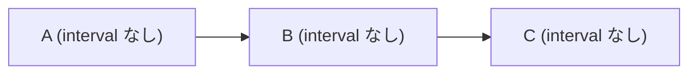

A は evaluate 2回（初回 + re-evaluate）、sync 1回。B と C は evaluate 1回（re-evaluate のみ）、sync 1回ずつです。上流から順に収束します。

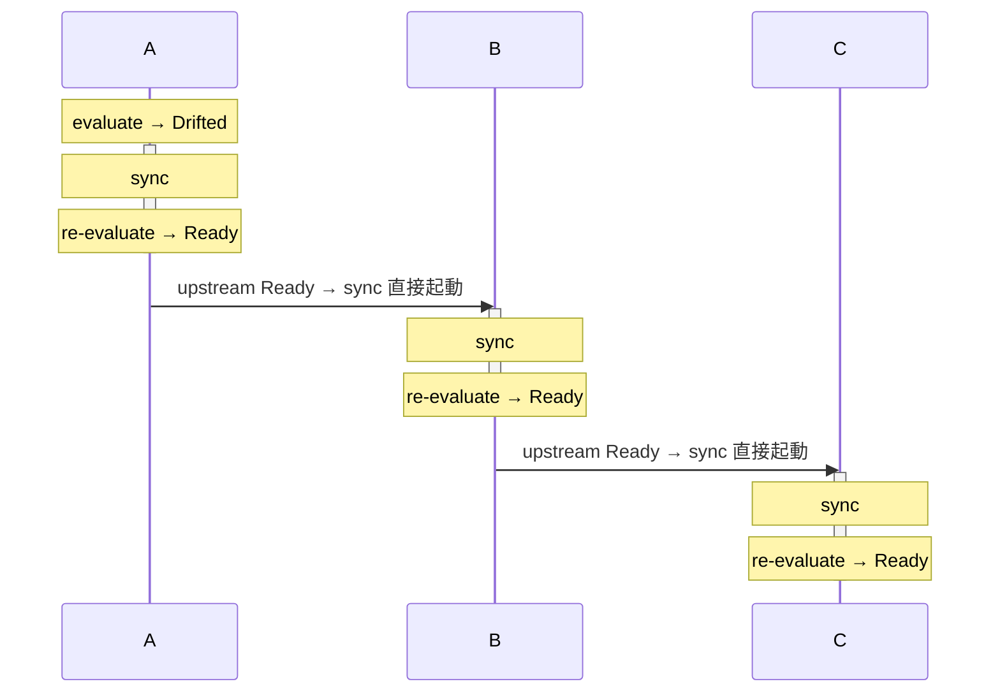

## Scenario 2: Multiple Upstreams Become Ready in Quick Succession

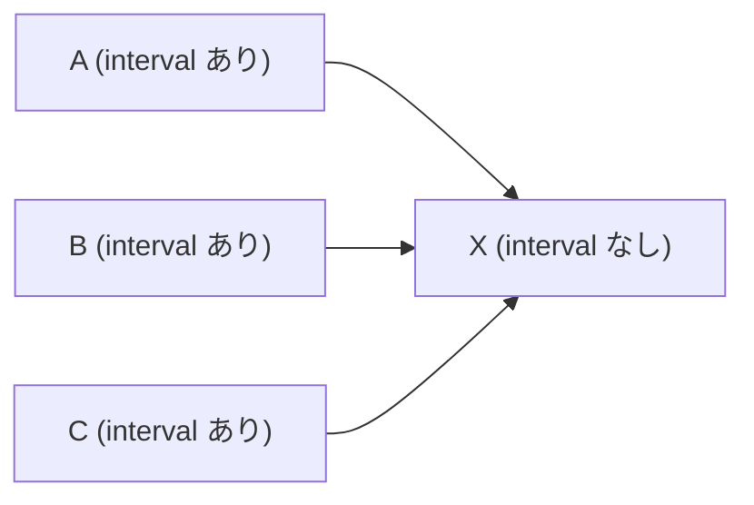

A, B, C が近いタイミングで Ready に遷移した例です。**X の sync は2回、evaluate は2回（sync 後の re-evaluate のみ）**です。B の伝播は X が sync 中のため無視されます。C の伝播は X の sync 完了後に受理され、2回目の sync が実行されます。これは C のデータ変更を X に反映するために必要な実行です。

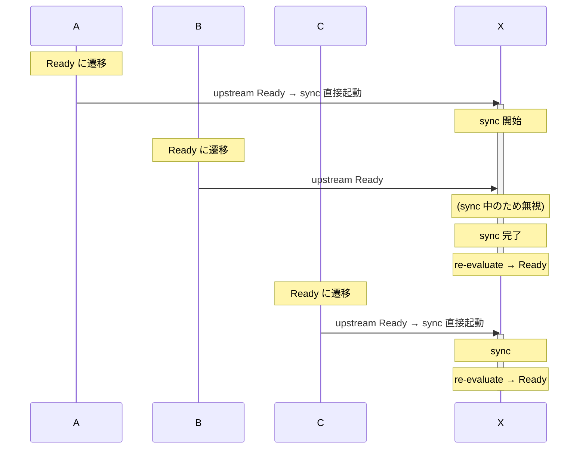

## Scenario 3: Upstreams Become Ready with Large Intervals

Case 2 と同じグラフで、上流の Ready 遷移が十分な間隔を空けて起きるケースです。**X の sync は3回、evaluate は3回（sync 後の re-evaluate のみ）**です。各上流のデータ変更を X に反映するため、それぞれ正当な実行です。

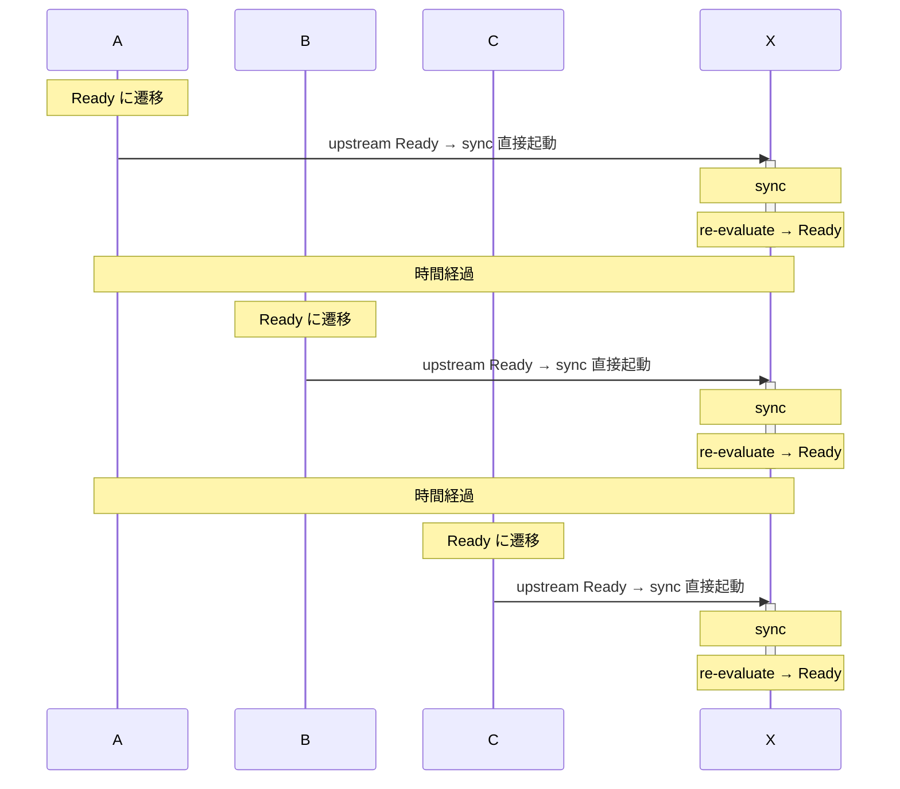

## Scenario 4: Fan-out

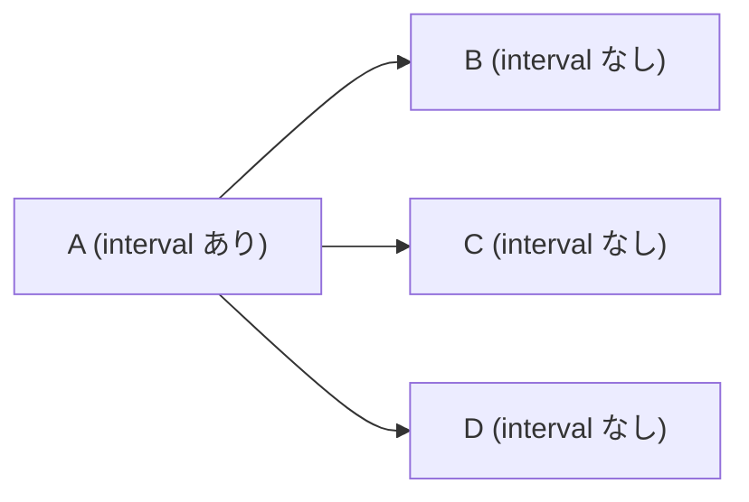

A が Ready に遷移すると、B, C, D の sync が直接起動されます。各 Asset で sync 1回、evaluate 1回（re-evaluate のみ）です。B, C, D は互いに依存関係がないため、sync は並列に実行されます。

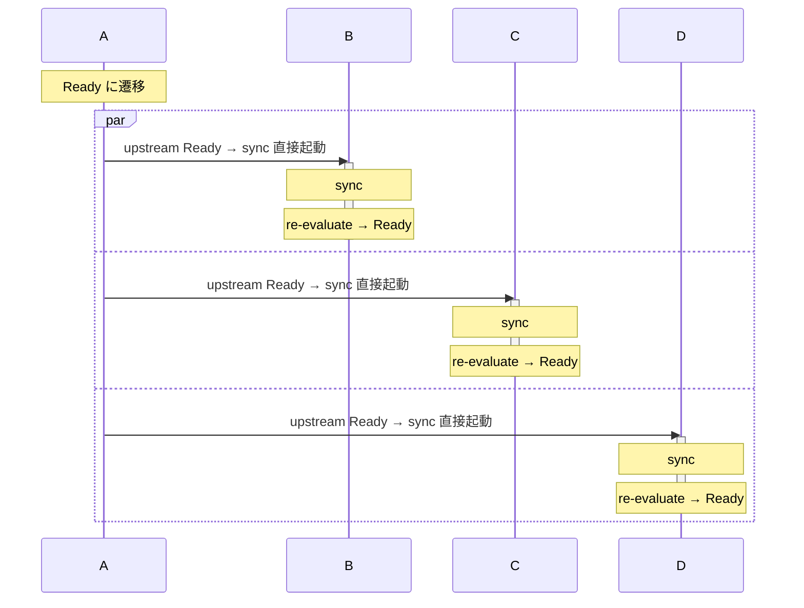

## Scenario 5: Diamond Dependency

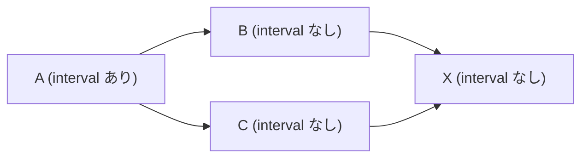

Fan-out と Fan-in の組み合わせです。A が Ready に遷移すると B と C の sync が直接起動されます。B と C が Ready に遷移すると、それぞれ X の sync を直接起動します。**X の sync は1回、evaluate は1回（re-evaluate のみ）**です。X の sync 中に C が Ready になっても、sync は再要求されません。

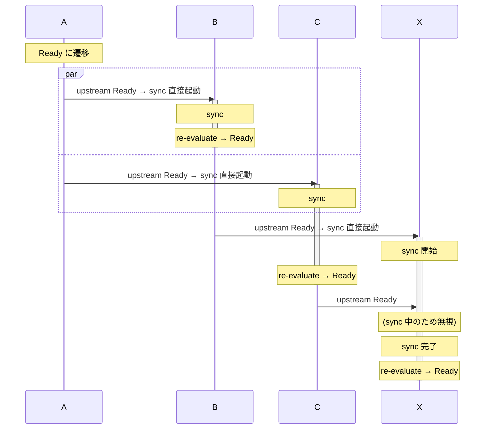

B と C の sync 完了が近いタイミングであっても、X の sync が実行中であれば重複実行は発生しません。

## Scenario 6: Interval with Upstream Propagation

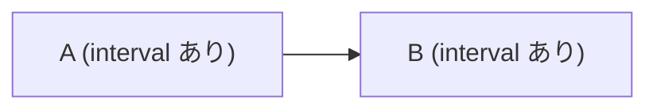

B はポーリングによる evaluate と、上流の状態変化による直接 sync の両方で動作します。この例では B の sync は1回（upstream Ready による直接起動）、evaluate は4回（interval 3回 + sync 後の re-evaluate 1回）です。

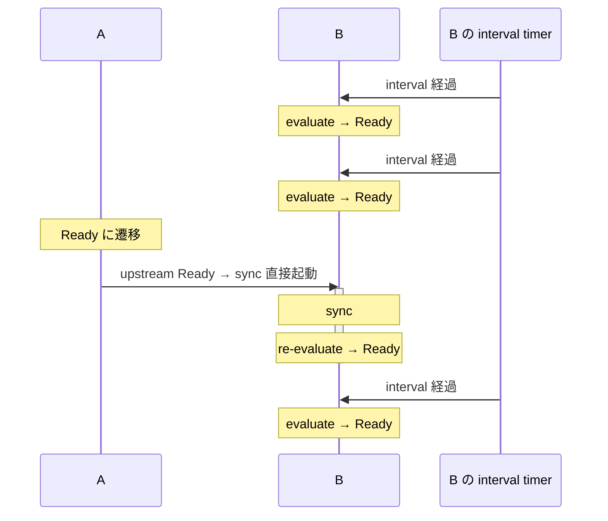

interval による evaluate は上流の状態変化とは独立して動作します。上流の Drifted → Ready 遷移では evaluate をスキップして直接 sync を起動しますが、interval による定期的な evaluate は引き続き実行されます。

## Scenario 7: Upstream Drifted Blocks Downstream Operations

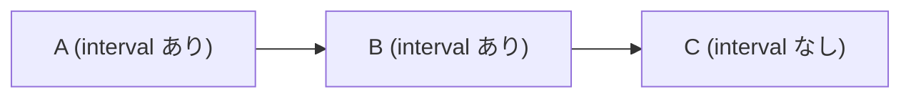

上流の A が Drifted の間、下流の B と C はすべての操作を待機します。B は interval を持っていますが、上流が Drifted であるため evaluate は実行されません。A の sync が完了して Ready になった時点で、下流へ upstream Ready が送られます。

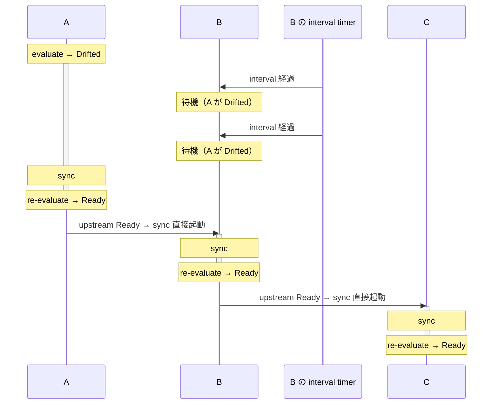
