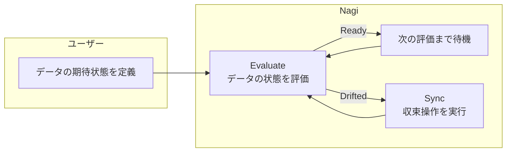

# Concepts

## Reconciliation Loop

Nagi では、データの期待状態や収束操作などの設定を YAML ファイルで記述します。この設定情報を**リソース**と呼びます。

Nagi はこのリソースに書かれた設定をもとに、データの期待状態の継続的な評価(**Evaluate**)と、期待状態を満たさないデータに対する収束操作(**Sync**)を実行します。この評価と収束のサイクルを繰り返します。



このループは [`nagi serve`](./cli.md#serve) で起動します。内部アーキテクチャの詳細は [Serve](./architecture/serve.md) を参照してください。

### Asset

Nagi では、データウェアハウスのテーブルやビューといったデータの単位を **Asset** と呼びます。

Asset には `onDrift` で条件（**Conditions**）と収束操作（**Sync**）のペアを定義します。条件は [`kind: Conditions`](./configurations/resources/conditions.md) リソースとして定義し、「24時間以内に更新されている」「特定カラムに NULL がない」「集計値が0以上である」といった内容です。

Asset は他の Asset や Source への依存関係を宣言できます。このドキュメントでは、依存元を**上流**、依存先を**下流**と呼びます。Nagi はその依存関係から依存グラフ（`target/graph.json`）を構築し、reconciliation loop の実行制御や実行対象の抽出に使用します。

### Evaluate

Evaluate は、Asset の条件を評価し、すべて満たしていれば **Ready**、1つでも満たしていなければ **Drifted** と判定する操作です。

Evaluate のトリガーは3種類あります。

- 定期的なポーリング（`interval`）
- cron 式で指定する追加の評価タイミング（`checkAt`、Freshness のみ）
- 上流 Asset の状態変化（上流 Asset が Drifted → Ready に遷移したとき、下流 Asset の評価を即座にトリガー）

各トリガーの設定方法は [kind: Asset](./configurations/resources/asset.md) を参照してください。

### Sync

Sync は、Drifted である Asset を期待状態に収束させる操作です。

Sync は3つのステージを順番に実行します。

| ステージ | 役割 | 例 |
| --- | --- | --- |
| Pre | 前処理。メイン処理の実行前に必要な準備を行う | ソースデータの再取得、一時テーブルの作成 |
| Run | メイン処理。データの変換や更新を行う | `dbt run`、SQL スクリプトの実行 |
| Post | 後処理。メイン処理の完了後に行うクリーンアップや通知 | 一時データの削除、外部システムへの通知 |

pre と post は省略可能です。各ステージは外部コマンドをサブプロセスとして実行します。

Sync の定義方法は [kind: Sync](./configurations/resources/sync.md) を参照してください。

#### First-match

Asset の `onDrift` には複数のエントリを定義できます。各エントリは `kind: Conditions` の名前と `kind: Sync` の名前のペアです。エントリは上から順に評価され、最初に条件が Drifted のエントリの Sync が実行されます。

```yaml
# 条件の定義
kind: Conditions
metadata:
  name: daily-sla
spec:
  - name: freshness-24h
    type: Freshness
    maxAge: 24h
    interval: 6h
---
kind: Conditions
metadata:
  name: sales-quality
spec:
  - name: no-negative-amount
    type: SQL
    query: "SELECT COUNT(*) = 0 FROM daily_sales WHERE amount < 0"
```

```yaml
# Asset で条件と Sync を対応付ける
onDrift:
  - conditions: daily-sla        # 1. まず鮮度を確認
    sync: dbt-incremental        #    → Drifted なら増分更新
  - conditions: sales-quality    # 2. 鮮度が OK なら品質を確認
    sync: dbt-full-refresh       #    → Drifted なら full refresh
```

この例では、鮮度条件（`daily-sla`）が Drifted であれば `dbt-incremental` が実行されます。鮮度が Ready で品質条件（`sales-quality`）が Drifted であれば `dbt-full-refresh` が実行されます。両方 Ready であれば Sync は実行されません。

Sync 完了後に再度 Evaluate を行い、まだ Drifted であれば再び Sync を実行します。状態の悪化や連続で失敗する場合は [Guardrails](#guardrails) が Sync を停止します。

#### autoSync

`autoSync: true`（デフォルト）の場合、Drifted を検知すると自動で Sync を実行します。`autoSync: false` に設定すると Evaluate のみ実行し、Sync は実行しません。最初は `false` で検知だけ行い、安定稼働したら `true` で自動収束する、という使い分けを想定しています。

### Guardrails

Asset の収束に改善が見られない場合は、その Asset の Sync を停止します。停止条件は下記のとおりです。

- Sync の実行によって状態が悪化した場合（Sync を実行する前より Ready な条件が減った場合）
- 同一 Asset への Sync が連続で失敗した場合

Evaluate は継続するため、手動修復の結果は [`nagi status`](./cli.md#status) に反映されます。Ready に戻った場合は自動的に Sync が再開されます。手動で再開する場合は [`nagi serve resume`](./cli.md#serve-resume) を実行してください。

### Execution Context

Evaluate と Sync では実行コンテキストが異なります。

| 実行コンテキスト | 対象 | 権限 | 接続方式 |
| --- | --- | --- | --- |
| Nagi の DB 接続 | Freshness, SQL | 読み取り専用 | Connection の接続情報で直接クエリ |
| サブプロセス | Command, Sync | ユーザー環境の権限 | 外部コマンドが独自の認証で実行 |

Nagi は DB 接続を通じた操作を読み取り専用に制限しています。SELECT 以外の文（INSERT / UPDATE / DELETE / DDL 等）は実行できません。データへの書き込みは Sync の Command（dbt 等）を経由して行います。

### Notifications

Evaluate の失敗や Guardrails の発動を他のアプリケーションへ通知できます。通知が未設定の場合は何も行われません。

通知条件や設定方法は [Notifications](./architecture/notifications.md) を参照してください。

通知されるイベント:

- EvalFailed — Evaluate がエラーで失敗した場合
- Suspended — Guardrails が Sync を停止した場合
- SyncLockSkipped — Sync のロック取得がリトライ上限に達し、Sync がスキップされた場合
- Halted — [`nagi serve halt`](./cli.md#serve-halt) による全 Asset 一括停止が行われた場合

### Where Nagi Fits

| 種別 | 役割 |
| ------ | ------ |
| ETL/ELT | データの取得・格納・加工 |
| Orchestration | ジョブのスケジュール起動と成否の監視 |
| Data testing | ジョブ実行時のデータ品質チェック |
| Data observability | データの状態の継続的な監視 |

Nagi の Evaluate は Data testing や Data observability にあたる操作を行い、Sync は ETL/ELT ツールが担う操作を担当します。

Data testing, Data observability に対しては、Nagi はこれらを置き換えるのではなく、その役割を補完します。それぞれの検証項目を条件として定義し、Evaluate と Sync のループを提供することで両者の効果を高めます。

一方、Orchestration に関しては、データの期待状態を起点にジョブを実行する reconciliation loop が役割を代替できます。

ここまで登場した Asset、Conditions、Sync といった概念は、すべてリソースとして `resources/` に定義します。各リソースの詳細は [Resources](./configurations/resources/index.md) を参照してください。

## Project Structure

Nagi は以下のディレクトリ構造を前提としています。

```text
my-project/
├── nagi.yaml          # プロジェクト設定
├── resources/         # リソース
│   └── ...
└── target/            # nagi compile で生成
    ├── assets/
    │   └── ...
    └── graph.json     # 依存グラフ

~/.nagi/                   # ストレージ（デフォルト）
├── cache/                 # evaluate 結果のキャッシュ
├── locks/                 # sync の排他ロック
├── suspended/             # Guardrails による停止フラグ
├── logs.db                # 実行履歴を保存する SQLite ファイル
└── logs/                  # sync の stdout/stderr を保存するログファイル
```

[`nagi.yaml`](./configurations/project.md) はプロジェクト全体の設定（ストレージバックエンド、通知先など）を担います。

`resources/` にはリソースを配置します。リソースの種類と定義方法は [Resources](./configurations/resources/index.md) を参照してください。

`target/` は [`nagi compile`](./cli.md#compile) が `resources/` をコンパイルして出力するディレクトリです。

`~/.nagi/` はデフォルトのストレージバックエンドです。GCS や S3 をリモートバックエンドとして使用することもできます。詳細は [Storage](./architecture/storage.md) を参照してください。

セットアップの手順は [Get Started](./get-started.md) を参照してください。
