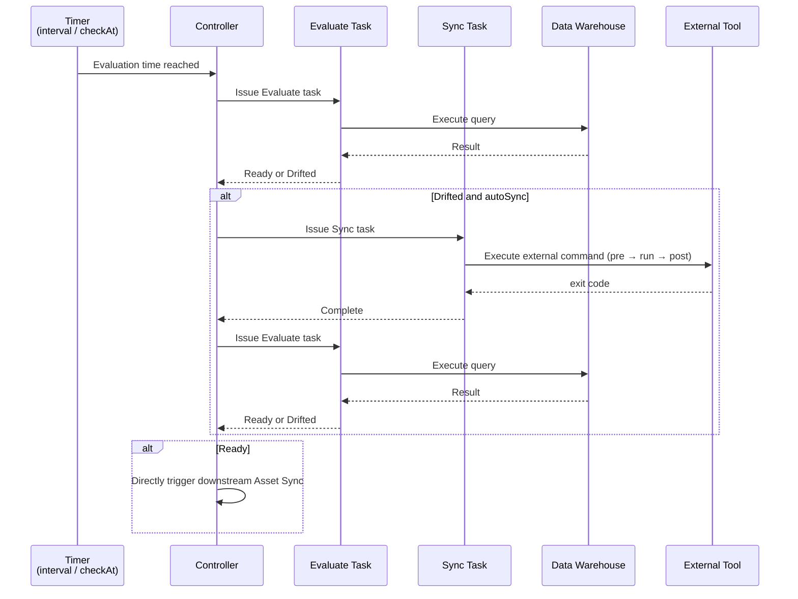
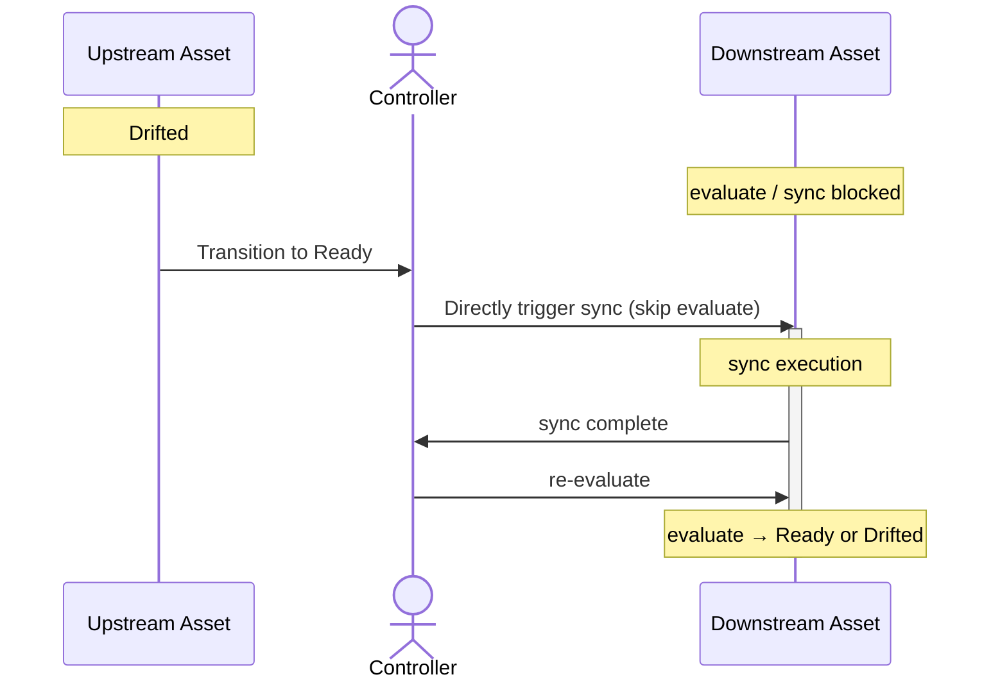

# Serve Internals

Describes the internal behavior of evaluation and convergence performed by [`nagi serve`](../../reference/cli.md#serve).

## Overview

`nagi serve` is a single-process, multi-task, continuous reconciliation runtime. Each connected component of the dependency graph — a group of Assets linked by dependencies — gets its own async Controller running in parallel. Before starting, it runs [`nagi compile`](../../reference/cli.md#compile) to load compiled Assets and the dependency graph, then begins the evaluation and convergence loop.



## Controller

A Controller is an async event loop responsible for a single connected component.

### Graph Partitioning

Connected components of the dependency graph are automatically detected, and Assets are partitioned into groups by connected component. A Controller is started for each group and operates in parallel.

```text
serve
├── Controller A (raw-sales → daily-sales → monthly-report)
├── Controller B (raw-logs → access-stats)
└── shutdown watch
```

When you run `nagi serve`, multiple controllers are started according to the graph structure. You do not need to think about partitioning.

### Controlled Events

The Controller listens for 4 types of events and executes the corresponding processing for each.

| Event | Processing |
| --- | --- |
| Polling / scheduled trigger | Add the specified Evaluate to the queue |
| Evaluate task completion | Record the evaluation result; if Drifted, add Sync to the queue. If transitioned to Ready, directly trigger downstream Asset Sync |
| Sync task completion | Record the result and add Evaluate to the queue. If failed, update Guardrails |
| Shutdown signal (Ctrl-C) | Stop issuing new tasks and wait for running syncs to complete |

Evaluate and Sync are each issued as async tasks, so they do not block the Controller loop.

### Concurrency Limits

You can limit the number of concurrent Evaluate and Sync tasks per Controller. This is used to control query load on the data warehouse when a large number of root Assets are queued immediately after startup, or when many downstream syncs are triggered simultaneously by an upstream Asset's transition to Ready.

Configure with `maxEvaluateConcurrency` and `maxSyncConcurrency` in [`nagi.yaml`](../../reference/project.md). If omitted, concurrency is unlimited.

## Evaluate Triggers

Evaluate is triggered by any of the following conditions.

### Interval

Setting `interval` runs Evaluate periodically at that interval.

The following is a guideline for whether to set it, by condition type.

| Condition type | interval | Decision criteria |
| --- | --- | --- |
| Freshness | Set | Required setting |
| SQL / Command | Set | When data may be updated outside of Nagi, or when you want to check state periodically |
| SQL / Command | Omit | When Sync and re-evaluate triggered by upstream Asset state changes are sufficient. Evaluation occurs only via re-evaluate after Sync |

### Scheduled Evaluation

For Freshness, in addition to periodic evaluation via `interval`, scheduled evaluation via `checkAt` can also be run. For example, this is useful when the data handoff time is fixed.

### Upstream State Change

When an Asset's state transitions from Drifted to Ready, Sync is executed for downstream Assets that depend on it. In this case, Evaluate is skipped and Sync is triggered directly. This is because the upstream Asset has transitioned from Drifted to Ready, because upstream recovery implies the downstream data may be stale.

After Sync completes, Evaluate is run to verify the convergence result.



While an upstream Asset is Drifted, all Evaluate and Sync operations for downstream Assets are blocked. Even if a downstream Asset has an interval setting, Evaluate is not run until the upstream Asset becomes Ready. Blocking ends when all upstream Assets become Ready.

See [Serve Scenarios](./scenarios.md) for other specific behavior patterns.

## Sync Execution

Sync is triggered by either of the following conditions.

1. When Evaluate determines the state is Drifted
2. When an upstream Asset transitions from Drifted to Ready (triggered directly, skipping Evaluate)

In addition, the following constraints apply to Sync execution.

| Constraint | Description |
| --- | --- |
| Exclusive lock | Only one Sync can run at a time for the same Asset. See [Storage: Locks](../storage.md#locks) for lock details |
| Guardrails | If state degradation after Sync or consecutive failures are detected, Sync for that Asset is automatically stopped. See [Concepts: Guardrails](../../overview/concepts.md#guardrails) for details |
| Auto sync | Configurable per Asset ([kind: Asset](../../reference/resources/asset.md) `autoSync`, default `true`). If `false`, only Evaluate is run and Sync is not executed |

After Sync completes, Evaluate is automatically run to verify the convergence result.

## Minimal State Design

`nagi serve` makes control decisions such as which Asset to evaluate next or which Sync to execute based on in-memory state. This means it does not consult storage to determine the next action during loop execution.

Some state is written to the storage backend (local files or remote storage) and persists across process restarts. The following two are the targets.

| State | Content | Purpose |
| --- | --- | --- |
| Readiness | Most recent evaluation result per Asset | Evaluate cache (skip queries within TTL), loop restoration on restart |
| Suspended | Suspension state set by Guardrails | Maintain suspension state across restarts |

Scheduler state, queues, and running task information are not persisted. Evaluation times after restart are recalculated from `interval`. See [Storage](../storage.md) for the full picture of persisted data.

## Graceful Shutdown

When SIGINT is received, graceful shutdown begins.

1. Stop issuing new Evaluate / Sync tasks
2. Abort running Evaluate tasks (read-only, so there are no side effects)
3. Wait for running Sync subprocesses to complete

The wait time limit can be configured with `terminationGracePeriodSeconds` in [`nagi.yaml`](../../reference/project.md) (no limit if omitted).

## Restart

See [Serve Restart](./restart.md) for state restoration on restart and its scenarios.
