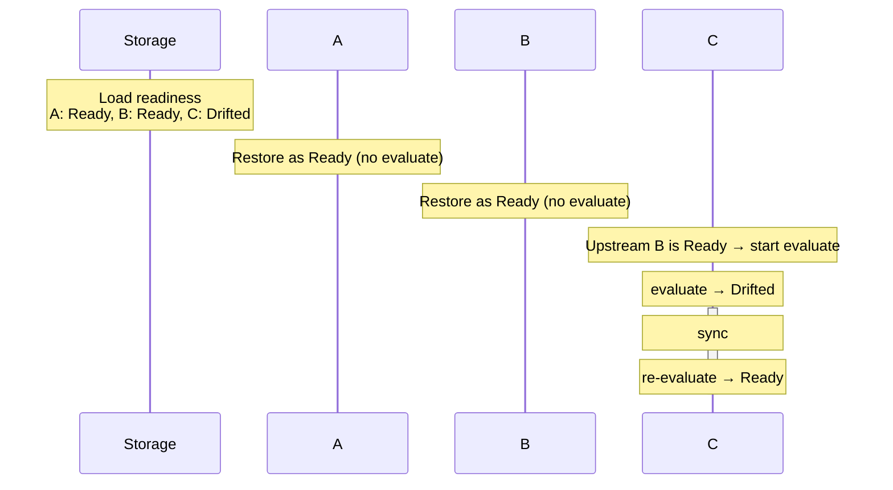
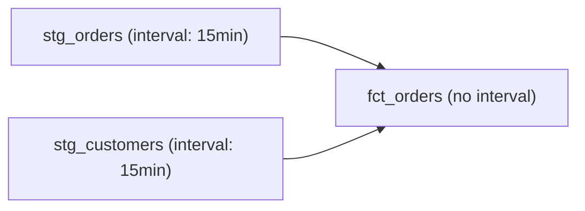
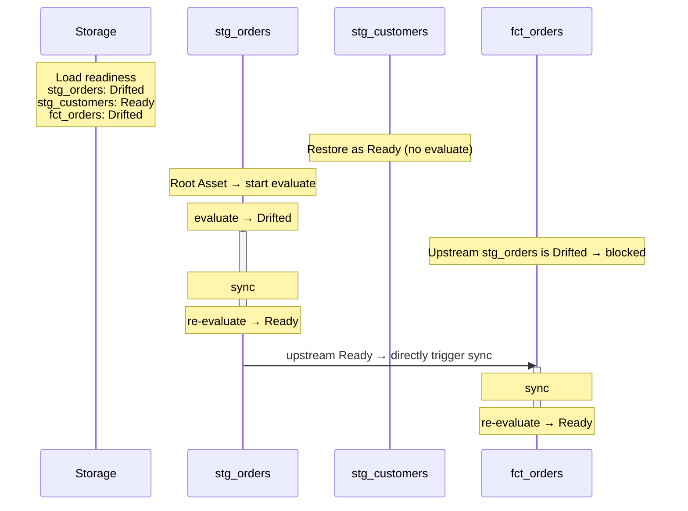

# Serve Restart

`nagi serve` can resume from the previous state after a process restart.

Nagi saves the latest evaluation result (Ready or Drifted) for each Asset to storage. By loading this information on restart, Assets that were previously Ready are restored as Ready, and only Assets that were Drifted resume from Evaluate.

!!! tip
    This mechanism assumes the same storage is accessible after restart. For local storage, ensure the disk is persistent; for remote storage, confirm the backend is configured in [`nagi.yaml`](../../reference/project.md). See [Storage](../storage.md) for storage details.

## Restart Sequence

1. Load readiness and suspended from storage
2. Assets that were previously Ready are restored as Ready. Evaluate is not run
3. Among Assets that were previously Drifted or have no readiness data, only root Assets (those without upstream dependencies) start Evaluate
4. Assets with `interval` re-register their timers. Evaluation times are recalculated from `interval`

If no readiness file exists (first startup), all Assets are treated as Drifted. Root Asset evaluation is executed within [Concurrency Limits](../../reference/project.md).

## Linear Chain with Partial Recovery

An example of restarting from a state where A through B were Ready in an A → B → C dependency chain.

A and B were previously Ready, so they remain Ready after restart. C was Drifted, so it starts from Evaluate, but it is not blocked because upstream B has been restored as Ready.

## Fan-in with Interrupted Sync

An example of a staging → fact table configuration where the process stopped during Sync. stg_orders and stg_customers are root Assets with interval, and fct_orders is their downstream. This shows the case where the process stopped during stg_orders' Sync, and stg_customers was Ready.

stg_customers was previously Ready, so it restores without any action.
stg_orders was Drifted, so it resumes from Evaluate, and once it becomes Ready, Sync to fct_orders is triggered.
fct_orders is blocked while stg_orders is Drifted and does not run even though stg_customers is Ready. This is because Sync is only triggered when all upstream Assets are Ready.
