# Serve Scenarios

This page explains `nagi serve` behavior through specific scenarios. Each scenario shows the timeline of when Evaluate and Sync are executed.

All scenarios assume `autoSync: true`.

## Scenario 1: Linear Dependency Chain

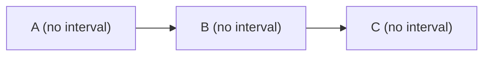

A has 2 evaluations (initial + re-evaluate) and 1 Sync. B and C each have 1 evaluation (re-evaluate only) and 1 Sync. Convergence proceeds from upstream to downstream.

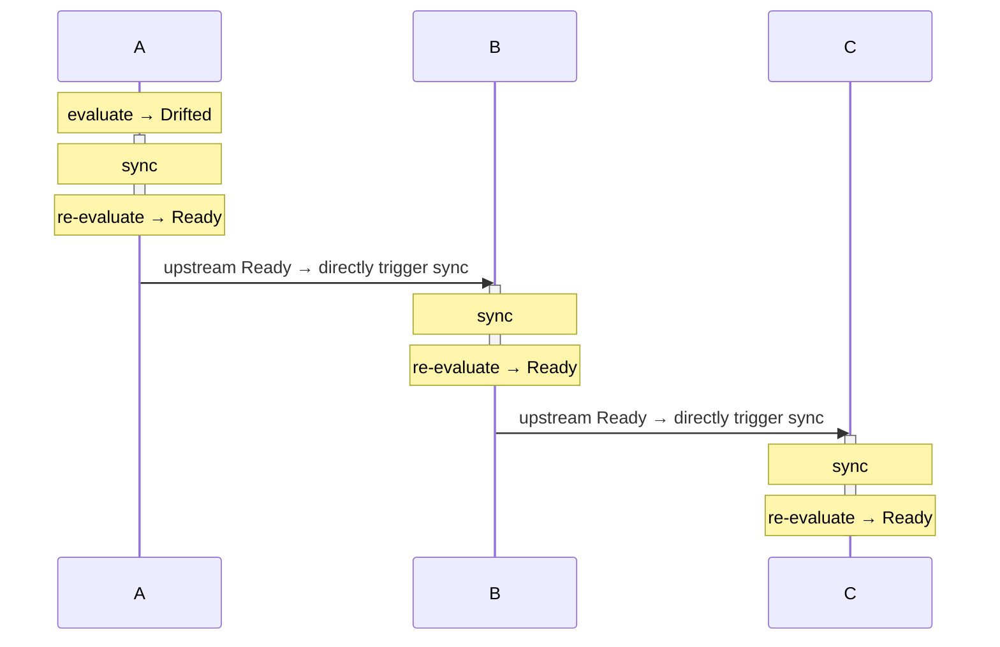

## Scenario 2: Multiple Upstreams Become Ready in Quick Succession

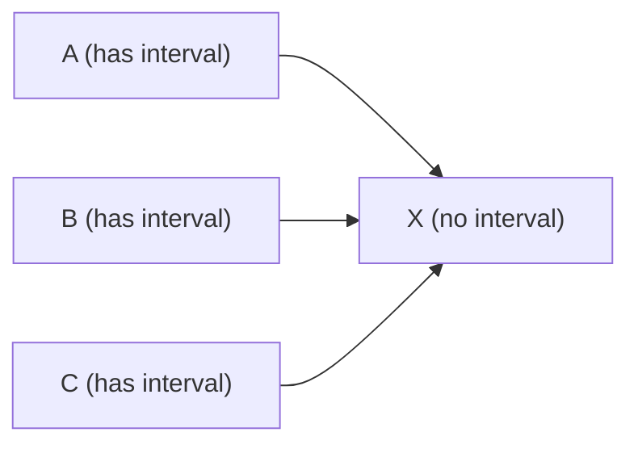

An example where A, B, and C transition to Ready in close succession. X has 2 Syncs and 2 evaluations (re-evaluate after Sync only). B's propagation is ignored because X is mid-Sync. C's propagation is accepted after X's Sync completes, and a second Sync is executed. This execution is necessary to reflect C's data changes into X.

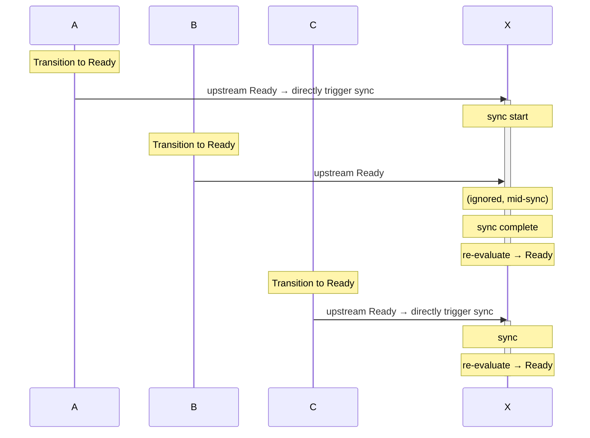

## Scenario 3: Upstreams Become Ready with Large Intervals

The same graph as Scenario 2, but with upstream Ready transitions occurring at well-spaced intervals. X has 3 Syncs and 3 evaluations (re-evaluate after Sync only). Each is a legitimate execution to reflect each upstream's data changes into X.

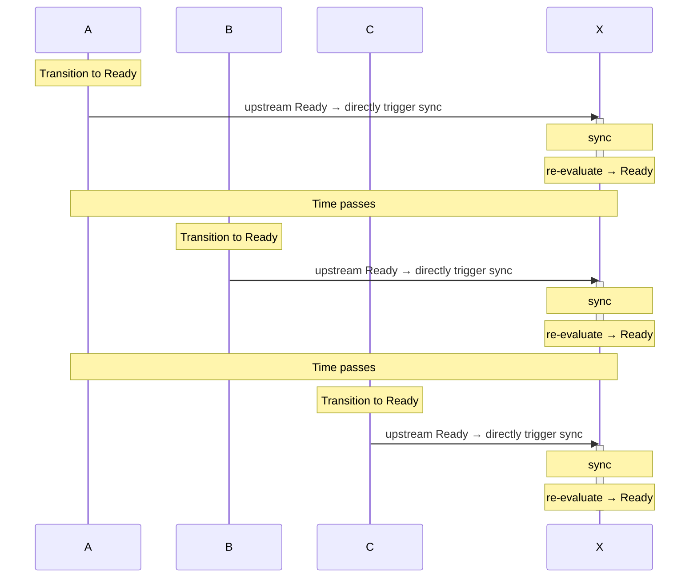

## Scenario 4: Fan-out

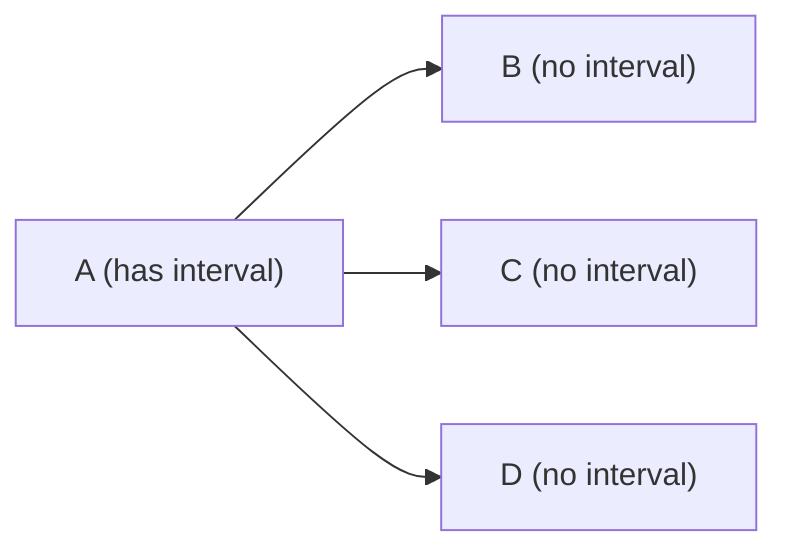

When A transitions to Ready, Sync for B, C, and D is directly triggered. Each Asset has 1 Sync and 1 evaluation (re-evaluate only). Since B, C, and D have no dependencies on each other, their Syncs run in parallel.

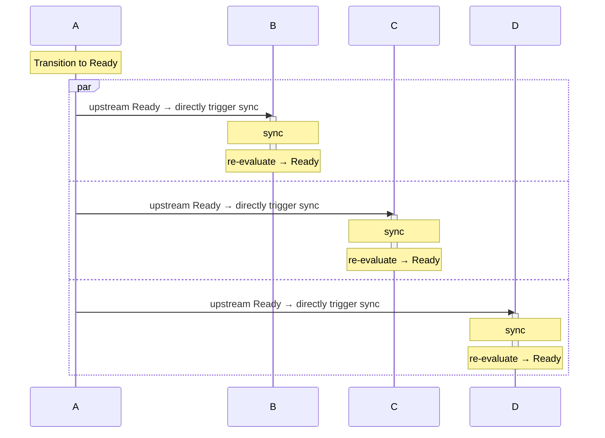

## Scenario 5: Diamond Dependency

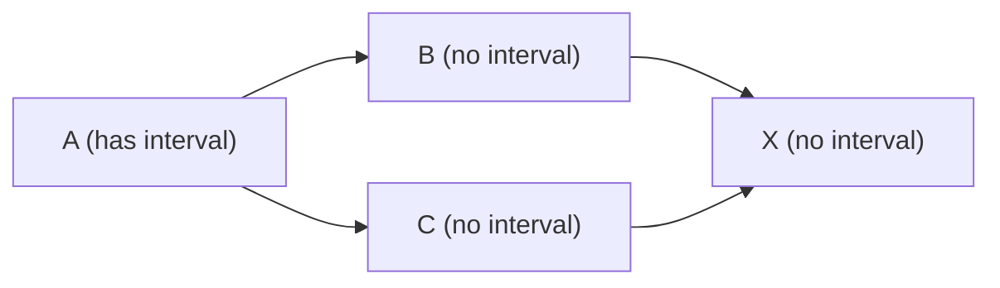

A combination of fan-out and fan-in. When A transitions to Ready, Sync for B and C is directly triggered. When B and C transition to Ready, they each directly trigger X's Sync. X has 1 Sync and 1 evaluation (re-evaluate only). Even if C becomes Ready while X is mid-Sync, Sync is not re-requested.

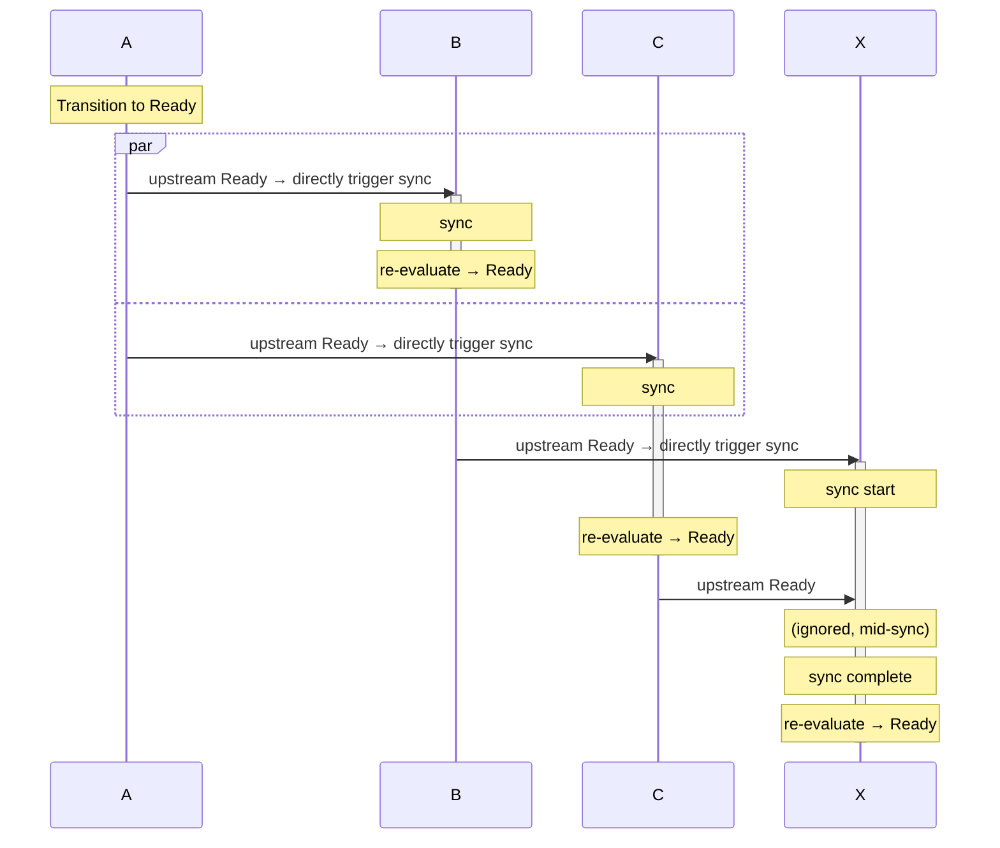

Even if Syncs for B and C complete at nearly the same time, duplicate execution does not occur as long as X's Sync is already running.

## Scenario 6: Interval with Upstream Propagation

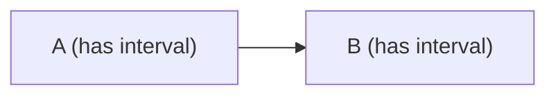

B operates via both polling-based Evaluate and direct Sync from upstream state changes. In this example, B has 1 Sync (directly triggered by upstream Ready) and 4 evaluations (3 from interval + 1 re-evaluate after Sync).

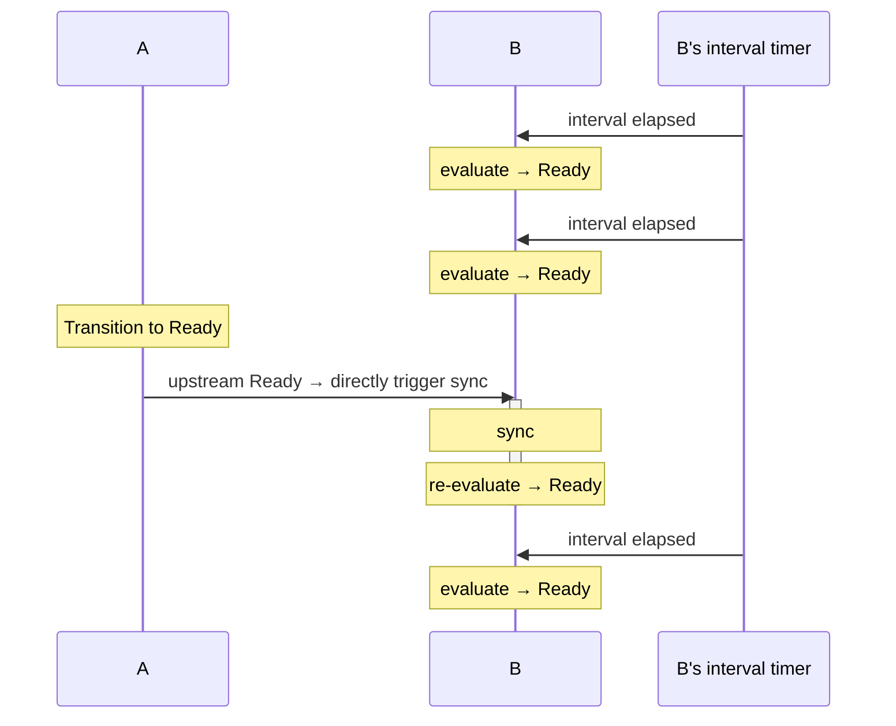

Interval-based evaluate operates independently of upstream state changes. While upstream Drifted-to-Ready transitions trigger Sync directly (skipping Evaluate), periodic Evaluate via interval continues to run.

## Scenario 7: Upstream Drifted Blocks Downstream Operations

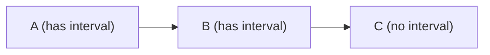

While upstream A is Drifted, downstream B and C wait for all operations. B has an interval, but Evaluate is not run because the upstream is Drifted. Once A's Sync completes and it becomes Ready, upstream Ready is sent downstream.

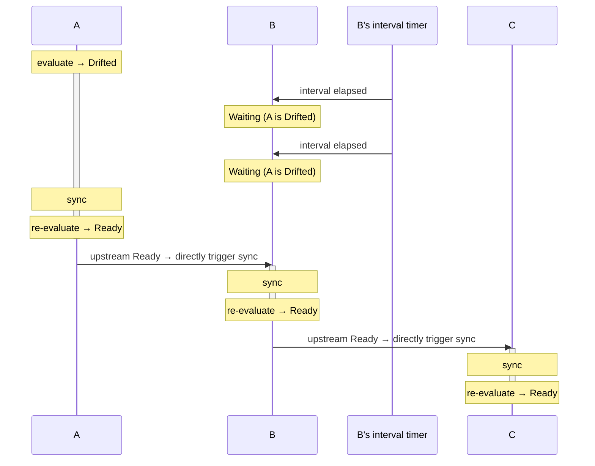
