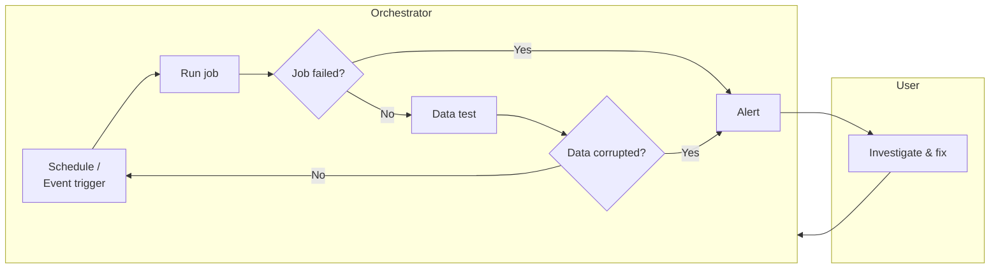
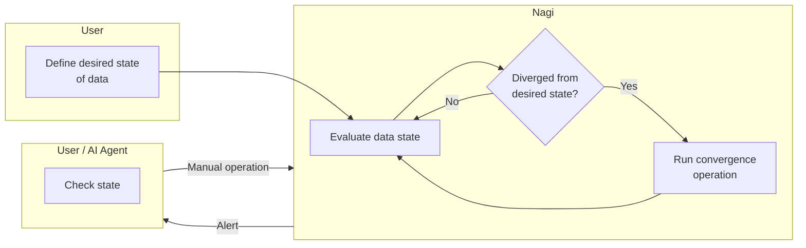

# Nagi

Nagi is a workflow engine that declaratively defines the desired state of data and continuously performs evaluation and convergence.

## Motivation

A successful job does not guarantee that data is as expected. Even when a job completes normally, data can be stale, contain NULLs, or have inconsistent aggregations.

Nagi starts by evaluating whether data is as expected. It continuously evaluates the desired state of data and, when drift is detected, runs the convergence operation defined for it. With desired states and convergence operations declared up front, Nagi unifies state evaluation, routine Extract/Load/Transform, and incident response into a single loop.

### Traditional Approach

### Nagi Approach

## Principles

- Declarative — Define the desired state; let the engine converge.
- Composable — Use with your existing tools, or let Nagi take the wheel.
- AI-collaborative — Designed for humans and AI agents to work as one.

## What's Next

- [Concepts](./overview/concepts.md) — Learn how the Reconciliation Loop works
