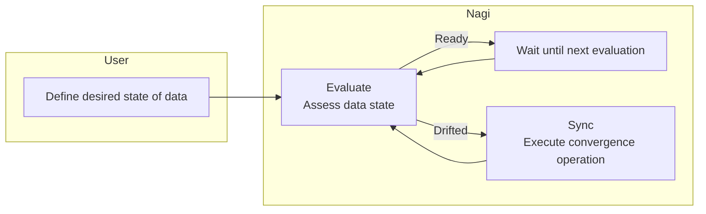
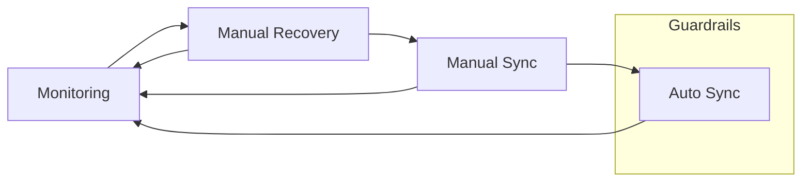

# Concepts

## Reconciliation Loop

In Nagi, you describe the desired state of data and convergence operations in YAML files. This configuration is called a **resource**.

Based on the resource definitions, Nagi evaluates whether data meets its desired state (**Evaluate**) and, when drift is detected, executes convergence operations (**Sync**). This cycle of evaluation and convergence repeats.

See [Serve](../architecture/serve/internals.md) for architecture details.

### Asset

In Nagi, a unit of data whose state is declared and kept converged by Evaluate and Sync is called an **Asset**.

An Asset is configured with a desired state and a convergence operation to execute when the desired state is not met.

An Asset can also declare dependencies on other Assets. Nagi uses these declarations to build a dependency graph that controls loop execution.

!!! tip
    In this documentation, the Asset being depended on is called **upstream**, and the Asset that depends on it is called **downstream**.

### Evaluate

Evaluate is an operation that assesses whether an Asset meets its desired state. If all conditions pass, the Asset evaluates to **Ready**; if any condition fails, it evaluates to **Drifted**.

There are three trigger conditions for Evaluate:

- Polling
- Scheduled execution via cron expression
- Verification immediately after a convergence operation

When an upstream Asset transitions from Drifted to Ready, the downstream Asset skips Evaluate and directly triggers Sync. While an upstream is Drifted, downstream Evaluate is blocked. See [Serve: Upstream State Change](../architecture/serve/internals.md#upstream-state-change) for specific behavior.

### Sync

Sync is an operation that converges a Drifted Asset toward its desired state.
Commands configured in Sync are expected to be idempotent. Because the Reconciliation Loop may execute Sync repeatedly, configure operations that produce the same result no matter how many times they run.

Sync executes three stages in order:

| Stage | Role | Example |
| --- | --- | --- |
| Pre | Pre-processing before the main operation | Preparing inputs, reserving resources |
| Run | Main operation that updates the Asset | Running a transformation job, invoking an API |
| Post | Post-processing after the main operation | Cleaning up temporary state, notifying external systems |

Pre and post are optional. Each stage executes the configured command as a subprocess.

## From Monitoring to Automation

When adopting Nagi, we recommend starting with data state evaluation and gradually expanding the scope of automation.

### Monitoring

Start by configuring only the desired state for an Asset and running Evaluate. Since no Sync is configured, Nagi will not modify any data.

### Manual Recovery

When data that does not meet the desired state is found, perform recovery without using Nagi. By repeating this process, you identify effective convergence operations for maintaining the desired state.

### Manual Sync

Define the convergence operation and its execution conditions as a Sync. The next time the same situation occurs, manually execute the Sync to attempt convergence.

### Auto Sync

Once manual Sync execution is stable, switch to automatic convergence. When Nagi detects data that does not meet the desired state, it automatically executes Sync.

By repeating this workflow, the goal is to **unify state evaluation, routine ELT, and data incident response into a continuous process**. As new patterns are discovered, following the same steps enriches the scope of automation.

An Asset can have multiple pairs of desired state and convergence operation. Nagi evaluates pairs from top to bottom and executes the convergence operation of the first pair that evaluates to Drifted. As patterns are added, more pairs accumulate, and the appropriate convergence operation is selected based on the current data state.

### Guardrails

If an Asset's state does not improve, Sync for that Asset is automatically stopped. The stop conditions are:

- Fewer desired states are satisfied after the Sync than before it was executed
- Consecutive Syncs for the same Asset have failed

Even when Sync is stopped, Evaluate continues. If the Asset's state returns to Ready, Sync is automatically resumed. It can also be resumed manually.

## Execution Context

Nagi separates the execution context for read operations and write operations. Nagi restricts its own database queries to read-only. Data writes happen through external commands in convergence operations.

## Notifications

Nagi can notify other applications of Evaluate failures or Guardrails activation. If no notification channel is configured, these events are silently ignored.

Notified events:

- EvalFailed — When Evaluate fails
- Suspended — When Guardrails stops Sync
- SyncLockSkipped — When Sync lock acquisition reaches the retry limit and Sync is skipped
- Halted — When a bulk stop of Sync for all Assets is performed

## What's Next

- [Quickstart](./quickstart.md) — Experience Nagi's workflow with a sample project
- [Get Started](./get-started.md) — Set up your environment
- [Architecture](../architecture/index.md) — Learn about the architecture in detail
- [Resources](../reference/resources/index.md) — Learn about resource types and how to define them
