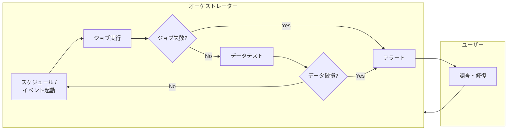
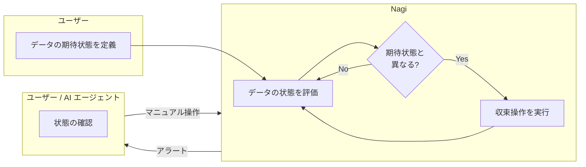

# Nagi

Nagi はデータのための reconciliation engine です。Kubernetes の reconciliation loop と同じ概念をデータエンジニアリングに適用しています。

データウェアハウスに存在するデータの期待状態を宣言的に定義し、その状態を継続的に評価します。期待状態を満たさないデータを検知すると、あらかじめ定義された収束操作を自動的に実行し、期待状態を満たす形へ修復します。この評価と収束のサイクルを繰り返します。

## Why Nagi

データエンジニアリングでは、「ジョブの成功」が「データが期待どおりであること」を保証しない場合があります。ジョブが正常終了しても、データが古い、NULL が混入している、集計値に不整合がある、といったことは起こり得るため、信頼に足るデータをつくれているかを常にチェックすることが重要です。

Nagi は「データが期待どおりであること」を起点に動作します。データの状態を継続的に評価し、その変化を検知したときに収束操作をトリガーします。収束操作をいつでも行えることで、実行スケジュールの調整やマニュアルでの対応がなくなります。期待状態が定義されていることで、その判断の一部を AI に任せることもできます。

### Traditional Approach

### Nagi Approach

## Principles

- Declarative — 期待状態と収束操作を宣言的に定義することで、評価と収束を安全かつ自動的に行います
- Integrative — 単体で使えるだけでなく、広く使われているソフトウェア群を補完する役割を担います
- AI-collaborative — 人間と AI エージェントが協調して運用します
