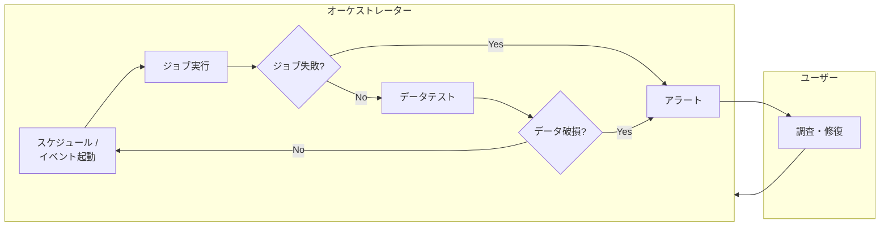
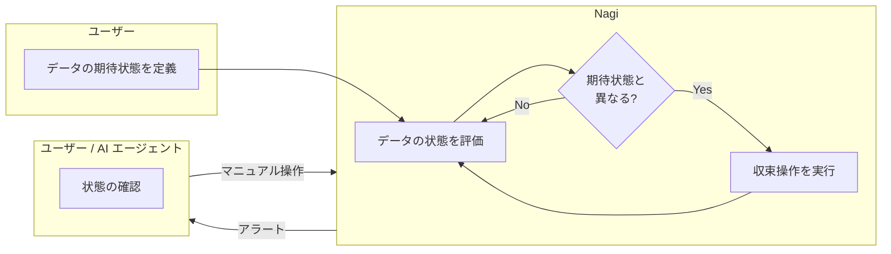

# Nagi

Nagi はデータの期待状態を宣言的に定義し、その評価と収束を継続的に行う data reconciliation engine です。

## Motivation

「ジョブの成功」は「データが期待どおりであること」を保証しません。ジョブが正常終了しても、データが古い、NULL が混入している、集計値に不整合がある、といったことは起こり得ます。

Nagi は「データが期待どおりであるか」の評価を起点に動作します。データの期待状態を継続的に評価し、乖離しているデータを見つけた場合は、それに対応する収束操作を実行します。期待状態と収束操作を宣言的に定義することで、状態評価と定常的な Extract/Load/Transform、障害対応をひとつのループに統合します。

### Traditional Approach

### Nagi Approach

## Principles

- Declarative — Define the desired state; let the engine converge.
- Composable — Use with your existing tools, or let Nagi take the wheel.
- AI-collaborative — Designed for humans and AI agents to work as one.

## What's Next

- [Concepts](./overview/concepts.md) — Reconciliation Loop の仕組みを知る
