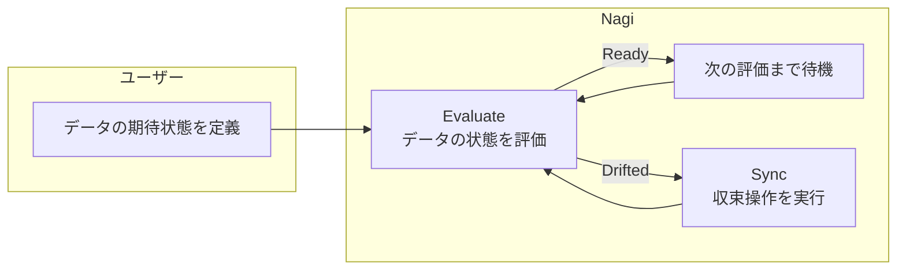
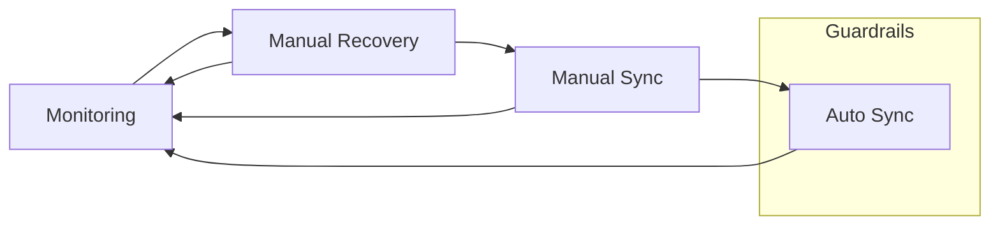

# Concepts

## Reconciliation Loop

Nagi では、データの期待状態や収束操作などの設定を YAML ファイルで記述します。この設定情報を**リソース**と呼びます。

Nagi はこのリソースに書かれた設定をもとに、データの期待状態の継続的な評価(**Evaluate**)と、期待状態を満たさないデータに対する収束操作(**Sync**)を実行します。この評価と収束のサイクルを繰り返します。

アーキテクチャの詳細は [Serve](../architecture/serve/internals.md) を参照してください。

### Asset

Nagi では、データウェアハウスのテーブルやビューといったデータの単位を **Asset** と呼びます。

Asset には期待状態と、期待状態を満たしていないときに実行する収束操作を設定します。

また Asset は、他の Asset への依存関係を宣言できます。Nagi はそれを読み取って依存グラフを構築し、ループの実行制御に使用します。

!!! tip
    このドキュメントでは、依存される側の Asset を **上流**、依存する側を **下流** と呼びます

### Evaluate

Evaluate は、Asset が期待状態を満たしているかを評価する操作です。すべて満たしていれば **Ready**、1つでも満たしていなければ **Drifted** と判定します。

Evaluate の起動条件は以下の3種類です。

- ポーリング
- cron 式での定時起動
- 収束操作直後の確認

上流 Asset が Drifted → Ready に遷移した場合は、下流 Asset の evaluate をスキップして直接 sync を起動します。また、上流が Drifted の間は下流の evaluate はブロックされます。具体的な動作については [Serve: Upstream State Change](../architecture/serve/internals.md#upstream-state-change) を参照してください。

### Sync

Sync は、Drifted である Asset を期待状態に収束させる操作です。
Sync に設定するコマンドは冪等性をもつことを期待しています。Reconciliation Loop は Sync を繰り返し実行する可能性があるため、何度実行しても同じ結果になる操作を設定してください。

Sync は3つのステージを順番に実行します。

| ステージ | 役割 | 例 |
| --- | --- | --- |
| Pre | 前処理。メイン処理の実行前に必要な準備を行う | ソースデータの再取得、一時テーブルの作成 |
| Run | メイン処理。データの変換や更新を行う | `dbt run`、SQL スクリプトの実行 |
| Post | 後処理。メイン処理の完了後に行うクリーンアップや通知 | 一時データの削除、外部システムへの通知 |

pre と post は省略可能です。各ステージでは、設定したコマンドをサブプロセスとして実行します。

## From Monitoring to Automation

Nagi の導入にあたっては、データの状態評価から始めて、自動化の範囲を段階的に広げていくことを推奨しています。

### Monitoring

Asset に期待状態のみを設定し、Evaluate を実行することからはじめます。Sync を設定しないので、Nagi がデータを編集することはありません。

### Manual Recovery

期待状態を満たしていないデータが見つかったら、Nagi を使わずに復旧作業を行います。この対応を繰り返す中で、期待状態の維持に有効な収束操作を明らかにします。

### Manual Sync

収束操作とその実行条件を Sync として定義します。次回同じ事象が発生したら、Sync を手動実行して収束を試みます。

### Auto Sync

Sync 手動実行での運用が安定したら、自動収束へ切り替えます。期待状態を満たしていないデータが見つかったときに Nagi が自動的に Sync を実行します。

このような流れを繰り返すことで、**状態評価と定常的な ELT、データ障害対応を地続きにする** ことを目指します。新たなパターンが見つかれば、同じ工程を踏むことで自動化の対象が充実していきます。

Asset には期待状態と収束操作のペアを複数定義できます。複数のペアは上から順に評価され、最初に Drifted のペアの収束操作が実行されます。パターンを追加するたびにペアが増えていき、状況に応じた収束操作が選択されるようになります。

### Guardrails

Asset の状態に改善が見られない場合は、その Asset の Sync を自動的に停止します。停止条件は下記のとおりです。

- Sync を実行する前より期待状態を満たしている数が減った場合
- 同一 Asset への Sync が連続で失敗した場合

Sync が停止されても、Evaluate は継続します。Asset の状態が Ready に戻った場合は自動的に Sync が再開されます。手動で再開することも可能です。

## Execution Context

Nagi は読み取り操作と書き込み操作の実行コンテキストを分離しています。Nagi が直接行うデータベースへの問い合わせは読み取り専用に制限されており、データへの書き込みは収束操作を通じて外部コマンドが行います。

## Notifications

Evaluate の失敗や Guardrails の発動を他のアプリケーションへ通知できます。通知が未設定の場合は何も行われません。

通知されるイベント:

- EvalFailed — Evaluate が失敗した場合
- Suspended — Guardrails が Sync を停止した場合
- SyncLockSkipped — Sync のロック取得がリトライ上限に達し、Sync がスキップされた場合
- Halted — すべての Asset の Sync 一括停止が行われた場合

## What's Next

- [Quickstart](./quickstart.md) — サンプルプロジェクトで Nagi の一連の流れを体験する
- [Get Started](./get-started.md) — セットアップを行う
- [Architecture](../architecture/index.md) — アーキテクチャの詳細を知る
- [Resources](../reference/resources/index.md) — リソースの種類と定義方法を知る
